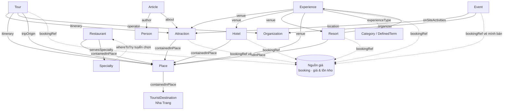

# 01 — CONTENT MODEL (bước 1: phạm vi và mô hình nội dung)

<!-- ═══════════════════════════════════════════════════════════════════
CORE SPEC · Nguồn: nhatrangtravel/project/01-CONTENT_MODEL.md · Nhóm B (khuôn KIẾN TRÚC mạnh nhất)
Khuôn tái dùng CAO về kiến trúc dữ liệu: triết lý "field chung 2.0 + base group" (LodgingBase),
ba họ gate completeness (sameAs bách khoa / officialSource thương mại / quan hệ), quy tắc giá
không lưu trong CMS (bookingRef một chiều), bộ 19 bất biến I1-I19, khối field quản trị
(reviewStatus/approvedBy/contentProvenance), i18n field-level vs document-level.
Phần riêng site cần thay (tìm 🔧 SITE-SPECIFIC):
  - Danh mục 14 entity cụ thể (TouristDestination=Nha Trang, Specialty=nem nướng/yến sào...).
  - Số lượng dự kiến từng loại, I15 hành chính "thành phố Nha Trang", 5 ngôn ngữ cứng.
Phần KHÔNG nhãn (cơ chế field 2.0, ba họ gate, quy tắc giá, khối quản trị, i18n) = khuôn vàng.
═══════════════════════════════════════════════════════════════════ -->

> Nguồn sự thật duy nhất cho mọi entity và field của dự án. Không entity hay field nào được tồn tại trong code mà không có ở đây trước (P4, P6, N5). Cowork soạn, chủ dự án duyệt.
>
> 🔧 **SITE-SPECIFIC:** danh mục 14 entity và mọi ví dụ (Specialty, TouristDestination, 5 ngôn ngữ) là của nhatrangtravel. Giữ *cơ chế* (field 2.0, ba họ gate, quy tắc bookingRef, khối quản trị); thay *danh mục entity* theo site.

- **Trạng thái:** đã duyệt. Founder soát toàn văn theo cụm 2026-06-11 (rà phản biện độc lập, 7 vết chốt qua trắc nghiệm), bước 1 đóng.
- **Phiên bản:** v1.0.11   **Ngày:** 2026-07-13   **Người soạn:** Cowork (tác nhân điều phối).
- **Nguồn quyết định:** brief mục 5-6 cộng các lựa chọn founder 2026-06-10 và 2026-06-11 (xem `DECISIONS.md` và `project/adr/` từ ADR-0002 đến ADR-0006).
- **Kế thừa ràng buộc:** CONSTITUTION v2.2.0, PROJECT_OVERLAY v1.0.2 (S2.2 bất biến dữ liệu, S2.3 ngưỡng, S2.4 SEO/GEO, S2.5 đa ngôn ngữ).
- **Override hiện hành:** từ 2026-06-30, `imageProvenance` là dữ liệu nội bộ tùy chọn, ẩn khỏi layout biên tập và không còn nằm trong gate publish I12. Từ 2026-07-02, `Attraction.containedInPlace` có thể trỏ `Place` hoặc `TouristDestination` khi Nha Trang là container thực tế; không khôi phục `seed.trung-tam-nha-trang`. Các dòng lịch sử bên dưới ghi "có khi có ảnh", "cộng imageProvenance khi có ảnh", hoặc "Attraction Place-only" chỉ còn là bối cảnh cũ, đã bị supersede bởi `DECISIONS.md`.

## 0. Quyết định nền (chốt với founder 2026-06-10 và 2026-06-11)

1. Danh mục 14 entity type (xem mục 1). Lộ trình: v0.1 có 8; v0.2 lên 13 — thêm Tour, Experience, tách Lodging thành Hotel và Resort, thu Organization về đúng vai đơn vị vận hành (ADR-0002); G3 thêm Specialty thành 14 (ADR-0005, founder duyệt qua trắc nghiệm 2026-06-11, đúng cửa một chiều 5.3). Vận tải không phải entity phase 1, xử bằng Article; điều kiện và thủ tục kích hoạt entity Transfer ghi ở ADR-0006.
2. Author là entity Person độc lập, không nhúng trong Article.
3. Nha Trang (TouristDestination) là container gốc, không phải đơn vị hành chính. Sau cải cách 2025, "thành phố Nha Trang" không còn tồn tại; vùng cũ tách thành 4 phường và tỉnh Khánh Hòa đã nhập Ninh Thuận. Thương hiệu du lịch Nha Trang không trùng ranh giới hành chính nào, nên model là TouristDestination là điều kiện đúng, không chỉ tiện. Xem mục 3 và bất biến I15.
4. Place là vùng địa lý chứa, Attraction là điểm đến cụ thể nằm `containedInPlace` một Place hoặc TouristDestination khi chính Nha Trang là container thực tế. Place vẫn là container ưu tiên khi có vùng địa lý đúng; không dựng lại Place không còn đúng chỉ để thỏa Place-only.
5. Experience là entity nối, biểu diễn quan hệ nhiều-nhiều giữa loại trải nghiệm và điểm đến (một loại trải nghiệm có ở nhiều điểm, một điểm có nhiều trải nghiệm). Giữ nội dung ở Sanity, giá ở nguồn giá.
6. Hotel và Resort tách hai entity vì là hai subtype tường minh có thật của schema.org LodgingBusiness và khác nhau về search intent, nhưng chia sẻ một base LodgingBase để không trôi khỏi nhau.
7. Completeness gate tách theo bản chất entity, ba họ. Họ sameAs bách khoa: Place, Attraction nhóm bách khoa (historic, temple, church, museum) và Specialty bắt buộc sameAs Wikidata hoặc Wikipedia (S2.2, I2, I17); riêng với Specialty gate này kiêm hàng rào lằn ranh — món signature của một quán không có danh tính bách khoa nên không thành entity (xem 2.14). Họ định danh thương mại: Restaurant, Hotel, Resort và Attraction nhóm venue thương mại dùng officialSource; geo/address là tùy chọn với mọi entity, chỉ điền khi có nguồn chắc. Organization dùng url cộng officialSource (I3) cộng gate quan hệ vào I18 — chỉ publish khi có Tour, Event hoặc Article trỏ tới, vì pháp nhân đứng sau venue không tự thành entity, lằn ranh theo vai trong graph (xem 2.9). Họ quan hệ: Experience và Tour publish theo quan hệ bắt buộc (I13, I14). Chi tiết gate từng entity ở mục 2.
8. Sanity không bao giờ lưu con số giá. Giá sống ở một nguồn giá riêng ngoài Sanity; entity thương mại trỏ qua `bookingRef` và site render giá lúc build: Experience, Tour, Hotel, Resort; Attraction bán vé vào cửa; Event khi chính mình bán vé với tư cách đại lý (ý định founder 2026-06-11, marketplace làm sau). Hiển thị giá đã kéo vào phase 1 (ADR-0003, sửa scope brief mục 5). Đơn vị tính giá (theo người, theo nhóm, theo suất) là một phần của dữ liệu giá, sống cùng con số bên nguồn giá, không thành field Sanity; build render trọn nhãn kiểu "120k/người"; hệ quả là spec nguồn giá ở bước 2 SAD phải có cột đơn vị. Trải nghiệm và sự kiện miễn phí đánh dấu bằng isAccessibleForFree; vé bán ở kênh ngoài không hoa hồng đi ticketUrl, không qua nguồn giá (xem 2.4, 2.10). Gõ con số giá thẳng vào doc Sanity cấm tuyệt đối (N5, S2.2).
9. Giá ổn định (trải nghiệm, tour, vé) hiện trực tiếp. Giá lưu trú biến động hiện dạng "từ X, cập nhật [ngày]" kèm ngày rõ ràng, lấy từ nguồn giá, không cam kết con số đặt phòng thời điểm.

## 1. Danh mục entity

| Entity | schema.org @type | Mô tả một dòng | Số lượng dự kiến (mốc ra mắt) | Nguồn sự thật |
|---|---|---|---|---|
| TouristDestination | TouristDestination | Chính Nha Trang, container địa lý gốc | 1 | Sanity |
| Place | Place | Vùng địa lý chứa: bãi biển, đảo, phường, khu vực | 8 đến 12 | Sanity |
| Attraction | [TouristAttraction, type cụ thể theo attractionType] | Điểm đến hoặc venue cụ thể để đến | 10 đến 15 | Sanity (nội dung), nguồn giá (vé) |
| Experience | TouristAttraction + additionalType | Hoạt động nổi bật tại một điểm (tắm bùn, lặn biển, 5D) | 15 đến 30 | Sanity (nội dung), nguồn giá (giá) |
| Restaurant | Restaurant | Nơi ăn uống, phục vụ cụm "ăn gì ở Nha Trang" | 8 đến 15 | Sanity |
| Specialty | Product + additionalType | Đặc sản: món ăn và sản vật mang danh tính vùng (nem nướng, bún chả cá, yến sào) | 8 đến 15 | Sanity |
| Hotel | Hotel | Lưu trú đô thị, phòng là chính, ưu tiên 4-5 sao | 8 đến 15 | Sanity (nội dung), nguồn giá (giá) |
| Resort | Resort | Cơ sở nghỉ dưỡng khép kín có tiện ích tại chỗ | 10 đến 20 | Sanity (nội dung), nguồn giá (giá) |
| Tour | TouristTrip | Hành trình nhiều điểm (tour biển đảo, tour Đà Lạt) | 5 đến 15 | Sanity (nội dung), nguồn giá (giá) |
| Organization | [TravelAgency hoặc Organization theo orgType] | Đơn vị vận hành: lữ hành, vận tải, lặn, DMC. Không phải nơi ở; chỉ publish khi có quan hệ vào (I18) | 3 đến 8 | Sanity |
| Event | [Festival, SportsEvent... theo eventType] | Lễ hội, sự kiện theo mùa, mỗi kỳ một doc | 3 đến 10 | Sanity (nội dung), nguồn giá (vé khi mình bán) |
| Article | Article | Bài viết: cẩm nang, lịch trình, danh sách, đánh giá, cẩm nang di chuyển | 10 đến 15 | Sanity |
| Person | Person | Tác giả của Article | 1 đến 3 | Sanity |
| Category | DefinedTerm | Từ vựng đóng do founder tuyển, gồm cả bộ experienceType | 15 đến 30 term | Sanity |
| siteSettings | — | Cấu hình toàn site: section order, hero text | 1 | Sanity |

Vận tải và đưa đón (sân bay Cam Ranh, xe liên tỉnh) không phải entity phase 1. schema.org không có type thông tin sạch cho nó (BusTrip là chuyến cụ thể gắn đặt vé), nên xử bằng Article articleType=transport-guide với howTo hoặc faq (gate ở 2.11). Hoãn là có chủ ý và đảo được; kích hoạt entity Transfer về sau là cửa một chiều theo 5.3 (founder chốt 2026-06-11), điều kiện kích hoạt — có booking cộng dữ liệu tuyến thật — ghi ở ADR-0006, ADR này đồng thời đính chính mệnh đề "cửa hai chiều" của ADR-0002.

Giá và tồn kho không phải entity. Chúng sống ở một nguồn giá riêng ngoài Sanity (booking hoặc nguồn giá tối giản); entity thương mại trỏ qua `bookingRef` và giá render lúc build (ADR-0003). Sanity không bao giờ lưu con số giá.

## 2. Field theo entity

JSON-LD không lưu thành field, sinh ở build từ các field dưới đây qua GROQ và Astro. Bất biến I6 đòi output hợp lệ 100%. Quy tắc serialize ở mục 5.

### 2.0 Field chung mọi entity

| Field | Kiểu | Bắt buộc? | Dịch? | Bất biến / quy tắc | Ai cung cấp |
|---|---|---|---|---|---|
| title | string | có | có | ngôn ngữ canonical là vi (S2.5) | người hoặc AI T1 |
| slug | slug | có | theo ngôn ngữ | duy nhất theo kiểu i18n của entity, I9; entity field-level: slug.lang sinh từ title.lang bằng slugify giữ chữ bản địa, không copy hay dịch từ slug.vi — thiếu title.lang thì không có slug.lang, trang ngôn ngữ đó không sinh (v1.0.10) | người hoặc AI |
| language | string enum vi, en, zh, ko, ru | có | — | bất biến sau publish; chỉ entity document-level (ADR-0004) | người |
| translationGroup | reference | có nếu có bản dịch | — | mỗi language tối đa một lần trong group, I7; chỉ entity document-level (ADR-0004) | hệ thống hoặc người |
| summary | text | có | có | đoạn mở đầu tự đứng được như câu trả lời hoàn chỉnh, I10 (S2.4) | người hoặc AI T1 |
| mainImage | image (Sanity CDN) | nên có | alt có | có ảnh thì bắt buộc alt | người |
| seo (metaTitle, metaDescription) | object | nên có | có | — | người hoặc AI |
| category | array reference đến Category | tùy | không | chỉ trỏ từ vựng đóng, I11 | người |
| publishedAt | datetime | có khi publish | không | dấu vết thời điểm | hệ thống |
| updatedAt | datetime | có | không | xuất dateModified, hiện cả HTML lẫn JSON-LD (S2.4) | hệ thống |
| reviewStatus | string enum (draft, inReview, approved) | có khi publish (gate I19) | không | tầng 5; chỉ approved mới được publish; đường duyệt T1 thành cơ học | hệ thống hoặc người |
| approvedBy | string | có khi publish (gate I19) | không | tên người duyệt, dấu vết trách nhiệm | người |
| contentProvenance | string enum (human, ai-t1, mixed) | có khi publish (gate I19) | không | nguồn gốc nội dung: người viết; AI sinh người duyệt (T1); trộn | người |

Bộ quản trị (ba dòng cuối bảng) định nghĩa một lần tại đây, không lặp ở bảng entity nào (chuẩn hóa G5, founder duyệt 2026-06-11). Enum đóng để máy kiểm được (I19) và thống kê được tỷ lệ AI trong dataset; ghi chú tự do về nguồn (nếu cần) nói trong commit hoặc DECISIONS, không thêm field. Ngoại lệ duy nhất: Category miễn cả bộ, vì từ vựng đóng do founder tuyển, việc tuyển chính là duyệt (xem 2.13).

### 2.0b LodgingBase (field group chung của Hotel và Resort)

Không phải entity, là base chia sẻ để Hotel và Resort không trôi khỏi nhau (quyết định 6). Map theo property của schema.org LodgingBusiness. Audit chi tiết founder duyệt 2026-06-11.

Lằn ranh Hotel với Resort (bài test 5.2 tiêu chí 6, founder chốt 2026-06-11): phân theo sản phẩm chính, không theo tên thương mại. Resort khi kỳ nghỉ diễn ra chủ yếu bên trong khuôn viên (khu khép kín, tiện ích tại chỗ đủ cho cả ngày, thường có bãi riêng). Hotel khi sản phẩm chính là phòng ngủ và trải nghiệm chính nằm ngoài cơ sở.

i18n field-level (ADR-0004), cùng quy tắc slug với 2.2.

| Field | Kiểu | Bắt buộc? | Dịch? | Bất biến / quy tắc | Ai cung cấp |
|---|---|---|---|---|---|
| geo | geopoint | tùy | không | — | người |
| address | object | tùy | một phần | addressLocality là phường hiện hành, I15 | người |
| officialSource | url | có (gate I3) | không | website chính thức | người |
| sameAs | array url | tùy | không | thêm nếu có Wikidata | người |
| starRating | number | tùy | không | thang sao; serialize object Rating {ratingValue} — schema.org expect Rating, không phải số trần (v1.0.8) | người |
| amenityFeature | array | tùy | một phần | map LocationFeatureSpecification | người |
| checkinTime, checkoutTime | time | tùy | không | — | người |
| numberOfRooms | number | tùy | không | chuyển từ Hotel lên base, resort cũng có phòng | người |
| petsAllowed | boolean | tùy | không | property LodgingBusiness | người |
| containedInPlace | reference đến Place hoặc TouristDestination | có | không | I8 | người |
| bookingRef | reference hoặc string | nên có | không | con trỏ tới sản phẩm bên nguồn giá, không lưu số, I1, I16 | người |
| beachAccess | text | nên có | có | tầng 4: đi bộ mấy phút tới bãi nào, hoặc bãi riêng; không suy được từ geo vì phụ thuộc đường đi thật | người |
| accessInfo | portable text | tùy | có | pattern dùng lại; cho resort đảo (cáp treo, tàu) và khu xa trung tâm; serialize nhập description (5.1) | người hoặc AI T1 |
| body | portable text | nên có | có | chuyển từ 2.6 và 2.7 lên base | người hoặc AI T1 |
| gallery | array image | nên có | alt có | pattern dùng lại | người |
| highlights | array | tùy | có | pattern dùng lại | người hoặc AI T1 |
| faq | array | tùy | có | FAQPage, pattern dùng lại | người hoặc AI T1 |
| imageProvenance | text | có khi có ảnh | không | một dòng chung nguồn và căn cứ sử dụng ảnh, mức entity (founder chốt 2026-06-11, xem DECISIONS kèm cảnh báo) | người |
Khoảng cách sân bay Cam Ranh không phải field: suy ở build từ geo (P6), hiện trên trang dạng "cách sân bay ~X km". Loại có chủ ý: aggregateRating và review (không UGC phase 1), photo (dùng gallery), priceRange (chạm I1, cấm tuyệt đối), availableLanguage, tourBookingPage (đường giá duy nhất là bookingRef).

Cấm mọi field con số giá hoặc tồn kho trong Sanity (I1). Giá render từ nguồn giá qua bookingRef; giá lưu trú biến động nên hiện dạng "từ X, cập nhật [ngày]" (I16, quyết định 9).

Gate publish (I12, I3): title, slug, summary, officialSource, containedInPlace, cộng imageProvenance khi có ảnh. geo/address tùy chọn, ẩn khỏi layout khi thiếu.

### 2.1 TouristDestination (Nha Trang)

Bộ field hub tầng 1 dưới đây founder đã duyệt phiên 2026-06-10 (trước đó chỉ ghi ở CHECKLIST, chép vào đây 2026-06-11 theo P4). Trang TouristDestination ở `/{destinationSlug}/` giữ vai điều phối điểm đến, tách khỏi trang chủ site `/`: keyFacts, featured*, relatedDestinations là field riêng của nó, các entity con không kéo theo. Rollup (things to do, where to stay, ăn gì, tour, event, đi lại, guide) suy ở build, không phải field. i18n field-level (ADR-0004), cùng quy tắc slug với 2.2.

| Field | Kiểu | Bắt buộc? | Dịch? | Bất biến / quy tắc | Ai cung cấp |
|---|---|---|---|---|---|
| sameAs | array url | có | không | Wikidata và Wikipedia của Nha Trang | người |
| geo | geopoint | nên có | không | tọa độ trung tâm | người |
| containedInPlaceRef | array url | có | không | trỏ tỉnh Khánh Hòa (mới) qua Wikidata, không cấp thành phố, I15 | người |
| body | portable text | có | có | mô tả tổng quan điểm đến | người hoặc AI T1 |
| keyFacts | array | nên có | có | số liệu nhanh cho người và máy | người hoặc AI T1 |
| homepageBanners | array object | tùy | một phần | banner biên tập riêng cho TouristDestination hub, tối đa 3 active khi render; không chứa giá, mã giảm giá, tồn kho hoặc claim khuyến mãi thiếu nguồn hợp lệ | người |
| highlights | array | nên có | có | pattern gốc, Place và Attraction dùng lại | người hoặc AI T1 |
| faq | array | nên có | có | FAQPage, pattern gốc | người hoặc AI T1 |
| gallery | array image | nên có | alt có | pattern gốc | người |
| featuredAttractions, featuredStays, featuredExperiences, featuredSpecialties, featuredTours | array reference | tùy | không | vai điều phối; chỉ trỏ entity đã publish; riêng featuredAttractions serialize thêm `includesAttraction` (property định nghĩa của TouristDestination, cạnh hub→attraction trong knowledge graph; lọc ref thuộc Attraction/Experience — hai loại serialize TouristAttraction), các featured* còn lại không xuất JSON-LD (v1.0.8) | người |
| relatedDestinations | array | tùy | không | điểm đến liên quan | người |
| safetyNote | text | tùy | có | lưu ý an toàn theo mùa | người hoặc AI T1 |
| imageProvenance | text | có khi có ảnh | không | một dòng chung nguồn và căn cứ sử dụng ảnh, mức entity; phủ theo nếp chung khi soát v1.0.0 | người |
| speakable | không lưu | — | — | xuất ở build trên node FAQPage (subjectOf) — speakable là property của WebPage/Article, không tồn tại trên TouristDestination/Place (I6); selector `[data-speakable]` do FAQ.astro render (v1.0.8) | build |

`homepageBanners` là object nhúng trong TouristDestination, không tạo entity type riêng. Field dịch được bên trong object gồm `title`, `description`, `linkLabel` theo localized object `{vi,en,zh,ko,ru}`; `linkUrl`, `image`, `variant`, `theme`, `isActive`, `priority` dùng chung giữa các ngôn ngữ. `title.vi`, `variant`, `theme`, `isActive`, `priority` bắt buộc trong mỗi banner. `variant` là enum đóng `vinpearl`, `island-tour`, `first-time`, `guide`, `custom`; `theme` là enum đóng `ocean`, `sand`, `pearl`, `image`. `linkUrl` tùy chọn nhưng nếu có phải bắt đầu bằng `/`, `https://`, `http://`, `tel:` hoặc `mailto:`. Có ảnh thì bắt buộc alt ảnh. Query homepage chỉ lấy banner `isActive == true`, xếp `priority` tăng dần, giới hạn 3.

Gate publish (I12): title, slug, summary, sameAs, containedInPlaceRef, body; cộng imageProvenance khi có ảnh. Dòng gate phát biểu tường minh ở v0.4 (founder duyệt 2026-06-11), gộp từ các field đã đánh bắt buộc sẵn, không đổi yêu cầu nào. I19 áp mọi entity từ 2.0, không ghi lặp ở dòng gate (quy ước chốt khi soát v1.0.0).

### 2.2 Place (đã audit chi tiết, founder duyệt 2026-06-11)

Lằn ranh với Attraction (bài test 5.2 tiêu chí 6): Place là đơn vị địa lý tự nhiên hoặc hành chính, tồn tại độc lập với việc khai thác du lịch (đảo, bãi, mũi đá, phường, khu vực). Attraction là công trình hoặc điểm tham quan do con người tạo và quản lý (tháp, chùa, công viên giải trí). Hòn Mun vẫn là Place dù thu phí bảo tồn; phí và giờ là thuộc tính, không đổi bản chất type.

i18n field-level (ADR-0004): một document duy nhất, field đánh "có" ở cột Dịch? là object localized theo ngôn ngữ; field bất biến (geo, sameAs, placeType...) lưu một lần. translationGroup không áp dụng. slug là object localized, duy nhất theo (_type, slug từng ngôn ngữ), xem I9. Slug mỗi ngôn ngữ sinh từ title của chính ngôn ngữ đó bằng slugify giữ chữ bản địa (Hangul, Hán tự, Cyrillic); không copy hay dịch từ slug.vi; thiếu title ngôn ngữ nào thì không sinh slug ngôn ngữ đó (v1.0.10, DECISIONS 2026-07-11).

Field chung (2.0) vẫn áp dụng. Bảng dưới là field riêng cộng quy tắc:

| Field | Kiểu | Bắt buộc? | Dịch? | Bất biến / quy tắc | Ai cung cấp |
|---|---|---|---|---|---|
| placeType | string enum (beach, island, landform, ward, area) | có | không | quyết @type cụ thể theo bảng map đóng dưới, không tự chế | người |
| sameAs | array url | có (gate I2) | không | Wikidata hoặc Wikipedia | người |
| geo | geopoint | tùy | không | điểm đại diện của vùng | người |
| address | object | nên có, trừ ward | một phần | addressLocality là phường hiện hành, I15; ward không có address vì chính nó là addressLocality | người |
| containedInPlace | reference đến Place hoặc TouristDestination | có | không | I8; riêng ward xem quy tắc serialize dưới | người |
| containsPlace | không lưu | — | — | suy ở build bằng reverse GROQ (P6) | build |
| incomingExperiences | string readOnly (Studio) | — | không | display-only trong Studio: custom input hiển thị rollup các Experience có venue trỏ tới place này; không lưu dữ liệu độc lập, không serialize, không nằm trong gate publish — cùng họ nguyên tắc "rollup suy ở build, không lưu" (P6), field này chỉ là bề mặt hiển thị cho biên tập viên | hệ thống |
| hasMap | url | tùy | không | — | người |
| accessInfo | portable text | tùy | có | cách tới nơi (vd Hòn Mun đi tàu từ Cầu Đá); tầng 4, không có property schema.org, xem quy tắc serialize | người hoặc AI T1 |
| openingHours, isAccessibleForFree | structured, boolean | tùy | không | chỉ nơi có quản lý giờ hoặc vé | người |
| body | portable text | nên có | có | mô tả | người hoặc AI T1 |
| gallery | array image | nên có | alt có | pattern dùng lại từ TouristDestination | người |
| highlights | array | tùy | có | pattern dùng lại, cho place lớn | người hoặc AI T1 |
| faq | array | tùy | có | pattern dùng lại, FAQPage cho place tra nhiều | người hoặc AI T1 |
| imageProvenance | text | có khi có ảnh | không | một dòng chung mức entity, phủ theo nếp chung khi soát v1.0.0 | người |
Bảng map placeType sang @type (đóng, thêm giá trị là cửa hai chiều theo 5.3):

| placeType | @type | additionalType |
|---|---|---|
| beach | [Beach, TouristAttraction] | — |
| island | [Landform, TouristAttraction] | https://www.wikidata.org/wiki/Q23442 (island) |
| landform | [Landform, TouristAttraction] | Wikidata theo loại (vd Q39594 vịnh, Q191992 mũi đất) |
| ward | AdministrativeArea | — |
| area | Place | tùy trường hợp, không bắt buộc |

schema.org không có type Island (đã kiểm V30.0); đảo serialize Landform cộng additionalType. LandmarksOrHistoricalBuildings không thuộc Place, nó là @type của Attraction (công trình lịch sử), đã xử ở 2.3 (attractionType historic).

Co-typing TouristAttraction (v1.0.8): beach/island/landform multi-type kèm TouristAttraction theo pattern chính tắc schema.org ("any Thing can be a TouristAttraction... typically use multityping"). Giữ danh tính địa lý làm type thứ nhất, TouristAttraction phát tín hiệu du lịch cho Google/LLM. ward/area là đơn vị hành chính và khu điều hướng, không co-type. Không trùng vai với entity Attraction (2.3): Place là địa danh tự nhiên, Attraction là điểm tham quan có quản lý.

Quy tắc serialize riêng:

- accessInfo nhập vào `description` của JSON-LD hoặc bỏ qua, cấm phát property tự chế (5.1, I6).
- Place loại ward: reference nội bộ containedInPlace vẫn trỏ TouristDestination để điều hướng và rollup, nhưng JSON-LD xuất containedInPlace là tỉnh Khánh Hòa qua Wikidata URL (dùng lại pattern containedInPlaceRef của 2.1), vì phường thuộc tỉnh, không thuộc thực thể nào tên Nha Trang (I15).
- Loại có chủ ý: aggregateRating và review (không UGC phase 1), photo (dùng gallery), event và Experience tại đây (rollup suy ở build từ Experience.venue và Event.location, không lưu), maximumAttendeeCapacity, smokingAllowed (không liên quan).
- Không kéo keyFacts, featured*, relatedDestinations từ TouristDestination: đó là vai điều phối của trang trụ, không phải của một bãi biển.

Gate publish (I12): title, slug, placeType, sameAs (I2), containedInPlace, summary (I10); cộng imageProvenance khi có ảnh. geo/address tùy chọn. Thiếu sameAs thì tạo Wikidata item, không nới gate.

### 2.3 Attraction (đã audit chi tiết, founder duyệt 2026-06-11)

Lằn ranh với Place (đã chốt ở 2.2): Attraction là công trình hoặc điểm tham quan do con người tạo và quản lý. Phạm vi phase 1 gồm 4 nhóm: tâm linh và di tích, giải trí có vé, tắm bùn suối khoáng, bảo tàng chợ công viên. Hai nhóm gate:

- Nhóm bách khoa (historic, temple, church, museum): có danh tính bách khoa sẵn, gate sameAs Wikidata hoặc Wikipedia (I2).
- Nhóm venue thương mại (theme-park, aquarium, mud-spa, market, park): gate officialSource; geo/address tùy chọn, chỉ điền khi có nguồn chắc. sameAs vẫn điền khi có. Với park, officialSource là trang cơ quan quản lý.

i18n field-level (ADR-0004), cùng quy tắc với Place: slug là object localized, I9 theo (_type, slug từng ngôn ngữ), không translationGroup. Field chung (2.0) vẫn áp dụng. Bảng field riêng:

| Field | Kiểu | Bắt buộc? | Dịch? | Bất biến / quy tắc | Ai cung cấp |
|---|---|---|---|---|---|
| attractionType | string enum (historic, temple, church, museum, theme-park, aquarium, mud-spa, market, park) | có | không | quyết type thứ hai trong mảng @type theo bảng map đóng dưới, và quyết nhóm gate | người |
| sameAs | array url | có với nhóm bách khoa (gate I2), nên có với nhóm venue | không | Wikidata hoặc Wikipedia | người |
| officialSource | url | có với nhóm venue (gate), tùy với nhóm bách khoa | không | website chính thức hoặc trang cơ quan quản lý | người |
| geo | geopoint | tùy | không | — | người |
| address | object | tùy | một phần | addressLocality là phường hiện hành, I15 | người |
| containedInPlace | reference đến Place hoặc TouristDestination | có | không | I8, quyết định nền 4: Place là ưu tiên khi đúng; TouristDestination hợp lệ khi Nha Trang là container thực tế | người |
| bookingRef | reference hoặc string | nên có với nơi bán vé | không | vé vào cửa, trỏ nguồn giá, không lưu số (I1, I16); giá gói hoạt động vẫn đi qua Experience | người |
| openingHours, isAccessibleForFree | structured, boolean | nên có với nơi bán vé, tùy còn lại | không | không phải giá | người |
| accessInfo | portable text | tùy | có | tầng 4, serialize nhập description, cấm property tự chế (5.1) | người hoặc AI T1 |
| hasMap | url | tùy | không | — | người |
| telephone | string | tùy | không | kênh hành động khi không có bookingRef, cùng lý do Restaurant (2.5); chủ yếu cho nhóm venue thương mại | người |
| body | portable text | nên có | có | mô tả, lịch sử, ý nghĩa | người hoặc AI T1 |
| gallery | array image | nên có | alt có | pattern dùng lại | người |
| highlights | array | tùy | có | pattern dùng lại | người hoặc AI T1 |
| faq | array | tùy | có | FAQPage, đặc biệt cho nơi hay bị hỏi giá vé và giờ | người hoặc AI T1 |
| imageProvenance | text | có khi có ảnh | không | một dòng chung mức entity, phủ theo nếp chung khi soát v1.0.0; nhóm rủi ro ảnh sưu tầm cao nhất | người |
Bảng map attractionType (đóng, thêm giá trị là cửa hai chiều theo 5.3). JSON-LD xuất @type dạng mảng hai type, vai du lịch cộng bản chất địa điểm:

| attractionType | @type xuất ra | ví dụ |
|---|---|---|
| historic | [TouristAttraction, LandmarksOrHistoricalBuildings] | Tháp Bà Ponagar |
| temple | [TouristAttraction, BuddhistTemple] | chùa Long Sơn |
| church | [TouristAttraction, Church] | nhà thờ Núi |
| museum | [TouristAttraction, Museum] | Bảo tàng Hải dương học |
| theme-park | [TouristAttraction, AmusementPark] | VinWonders |
| aquarium | [TouristAttraction, Aquarium] | thủy cung Trí Nguyên |
| mud-spa | [TouristAttraction, DaySpa] | I-Resort, Tháp Bà spa |
| market | [TouristAttraction, ShoppingCenter] | chợ Đầm |
| park | [TouristAttraction, Park] | công viên bờ biển |

Loại có chủ ý: aggregateRating và review (không UGC phase 1), photo (dùng gallery), tourBookingPage (đường giá duy nhất là bookingRef), event và Experience tại đây (rollup suy ở build từ Event.location và Experience.venue), maximumAttendeeCapacity, smokingAllowed.

Gate publish (I12): title, slug, attractionType, containedInPlace, summary, cộng theo nhóm: sameAs (bách khoa) hoặc officialSource (venue); cộng imageProvenance khi có ảnh. geo/address và bookingRef không nằm trong gate.

### 2.4 Experience (đã audit chi tiết, founder duyệt 2026-06-11)

Entity nối, biểu diễn nhiều-nhiều giữa loại trải nghiệm và điểm đến (quyết định 5). Lằn ranh với Attraction và Place (bài test 5.2 tiêu chí 6): Experience là việc để làm, Attraction và Place là nơi để đến. Một venue có thể vừa là Attraction (I-Resort) vừa mang nhiều Experience (tắm bùn, onsen).

Món treo pricingModel đóng 2026-06-11: đơn vị tính giá (theo người, theo nhóm, theo suất) không thành field Sanity, nó sống cùng con số bên nguồn giá (quyết định nền 8). Trải nghiệm miễn phí đánh dấu bằng isAccessibleForFree.

i18n field-level (ADR-0004), cùng quy tắc slug với 2.2. Field chung (2.0) vẫn áp dụng. Bảng field riêng:

| Field | Kiểu | Bắt buộc? | Dịch? | Bất biến / quy tắc | Ai cung cấp |
|---|---|---|---|---|---|
| experienceType | reference đến Category (bộ experience-type) | có (gate I13) | không | loại trải nghiệm tái dùng, vd tắm bùn, lặn biển, 5D; nguồn additionalType khi serialize | người |
| venue | reference đến Attraction, Hotel, Resort hoặc Place | có (gate I13) | không | nơi diễn ra, tồn tại | người |
| isAccessibleForFree | boolean | tùy | không | trải nghiệm miễn phí (ngắm hoàng hôn, tắm biển); true thì không cần bookingRef; pattern dùng lại từ Place | người |
| duration | string ISO 8601 (vd PT2H) | tùy | không | render theo locale ở build; serialize nhập description hoặc bỏ (5.1) | người |
| includes | array string | tùy | có | gồm những gì (xe đưa đón, thiết bị); serialize nhập description hoặc bỏ (5.1) | người hoặc AI T1 |
| touristType | array string | tùy | có | đối tượng phù hợp (gia đình, trẻ em); property thật của TouristAttraction | người |
| geo | geopoint | tùy | không | kế thừa venue nếu trống, suy ở build | người |
| bookingRef | reference hoặc string | nên có với trải nghiệm trả phí | không | con trỏ tới sản phẩm bên nguồn giá, không lưu số, I1, I16 | người |
| body | portable text | nên có | có | mô tả trải nghiệm | người hoặc AI T1 |
| gallery | array image | nên có | alt có | pattern dùng lại | người |
| highlights | array | tùy | có | pattern dùng lại | người hoặc AI T1 |
| faq | array | tùy | có | FAQPage, nơi hay bị hỏi giá và lịch | người hoặc AI T1 |
| imageProvenance | text | có khi có ảnh | không | một dòng chung mức entity, theo quyết định lưu trú 2026-06-11 | người |
Serialize: @type TouristAttraction, additionalType lấy từ experienceType qua Category.sameAs (Wikidata của loại hoạt động, vd lặn biển); khuyến nghị mỗi term bộ experience-type có sameAs. duration và includes nhập description hoặc bỏ, cấm property tự chế (5.1). Loại có chủ ý: aggregateRating và review (không UGC phase 1), offers (I1, giá ở nguồn giá), photo (dùng gallery), availableLanguage (chưa cần phase 1).

Cấm field con số giá trong Sanity (I1). Giá của trải nghiệm sống ở nguồn giá, render qua bookingRef.

Gate publish (I12, I13): title, slug, summary, experienceType, venue; cộng imageProvenance khi có ảnh. bookingRef không nằm trong gate.

### 2.5 Restaurant (đã audit chi tiết, founder duyệt 2026-06-11)

Phục vụ cụm "ăn gì ở Nha Trang". Lằn ranh với Specialty (bài test 5.2 tiêu chí 6): Restaurant là cơ sở, Specialty là món hoặc sản vật mang danh tính vùng; món signature riêng của một quán (bò nướng Lạc Cảnh) sống trong body hoặc highlights của quán đó, không thành entity.

i18n field-level (ADR-0004), cùng quy tắc slug với 2.2. Field chung (2.0) vẫn áp dụng. Bảng field riêng:

| Field | Kiểu | Bắt buộc? | Dịch? | Bất biến / quy tắc | Ai cung cấp |
|---|---|---|---|---|---|
| geo | geopoint | tùy | không | — | người |
| address | object | tùy | một phần | addressLocality là phường hiện hành, I15 | người |
| officialSource | url | có (gate I3) | không | website hoặc fanpage chính thức | người |
| sameAs | array url | tùy | không | thêm nếu có Wikidata | người |
| servesCuisine | array string | nên có | có | property FoodEstablishment | người |
| servesSpecialty | array reference đến Specialty | nên có | không | quan hệ sự kiện "quán có món này"; nguồn cho rollup "ăn ở đâu" suy ngược ở build (P6); serialize `makesOffer` (Offer/itemOffered trỏ Specialty, không giá — I1 nguyên vẹn; cạnh hợp lệ duy nhất Restaurant→Product, thay mapping hasMenu sai kiểu trước đây) (v1.0.8) | người |
| containedInPlace | reference đến Place hoặc TouristDestination | có | không | I8 | người |
| openingHours | structured | tùy | không | — | người |
| acceptsReservations | boolean hoặc url | tùy | không | property FoodEstablishment | người |
| hasMenu | url | tùy | không | link menu chính thức bên ngoài; giá nếu có sống ở đó, không lưu (I1) | người |
| telephone | string | tùy | không | kênh hành động chính khi không có bookingRef; Hotel và Resort không cần vì đường hành động là nguồn giá | người |
| body | portable text | nên có | có | mô tả, không gian, mức giá nói như văn xuôi | người hoặc AI T1 |
| gallery | array image | nên có | alt có | pattern dùng lại | người |
| highlights | array | tùy | có | pattern dùng lại, gồm món signature riêng của quán | người hoặc AI T1 |
| faq | array | tùy | có | FAQPage, pattern dùng lại | người hoặc AI T1 |
| imageProvenance | text | có khi có ảnh | không | một dòng chung mức entity, theo quyết định lưu trú 2026-06-11 | người |
Loại có chủ ý (founder chốt 2026-06-11): priceRange, dù Google khuyến nghị cho LocalBusiness, giữ nhất quán hai quyết định trước (dải ký hiệu gõ tay đã loại 2026-06-10; LodgingBase loại 2026-06-11); tín hiệu mức giá nói trong body như văn xuôi, menu có giá link ra ngoài qua hasMenu. Cùng loại: aggregateRating và review (không UGC phase 1), photo (dùng gallery), smokingAllowed, currenciesAccepted, paymentAccepted, Menu và MenuItem structured (không dựng menu máy đọc, ngoài phạm vi nội dung phase 1).

Không field con số giá trong Sanity (I1). Restaurant không có bookingRef: entity Sanity-only, không hoa hồng booking.

Gate publish (I12, I3): title, slug, summary, officialSource, containedInPlace; cộng imageProvenance khi có ảnh. geo/address tùy chọn.

### 2.6 Hotel (đã audit, founder duyệt 2026-06-11)

LodgingBase (2.0b) toàn phần, không có field riêng. @type Hotel. Lằn ranh theo sản phẩm chính (xem 2.0b): sản phẩm chính là phòng ngủ, trải nghiệm chính nằm ngoài cơ sở.

Tiện ích doanh nhân (phòng họp, hội nghị, dịch vụ văn phòng) không có field riêng: đi qua `amenityFeature` của LodgingBase (2.0b), cùng cấp với mọi tiện ích khác. Field `businessFacilities` cũ đã bị dẹp 2026-07-01 vì trùng vai trò với `amenityFeature`. Dữ liệu cũ migrate vào `amenityFeature`.

### 2.7 Resort (đã audit, founder duyệt 2026-06-11)

LodgingBase (2.0b) cộng field dưới. @type Resort. Lằn ranh theo sản phẩm chính (xem 2.0b): kỳ nghỉ diễn ra chủ yếu bên trong khuôn viên.

| Field | Kiểu | Bắt buộc? | Dịch? | Bất biến / quy tắc | Ai cung cấp |
|---|---|---|---|---|---|
| beachfront | boolean | tùy | không | sát biển hay không | người |
| onSiteActivities | array | tùy | có | hoạt động tại chỗ, có thể trỏ Experience | người |
| landArea | number | tùy | không | diện tích khuôn viên | người |

### 2.8 Tour (đã audit chi tiết, founder duyệt 2026-06-11)

@type TouristTrip. Lằn ranh với Experience (bài test 5.2 tiêu chí 6): Experience là một hoạt động gắn một venue; Tour là hành trình có đơn vị vận hành đi qua nhiều điểm theo thứ tự, có đón trả. Tắm bùn I-Resort là Experience; chuỗi "đón khách sạn, 4 đảo, lặn Hòn Mun, về cảng" là Tour.

Phân loại tour (biển đảo, city, liên tỉnh) không có field riêng: dùng field chung category (2.0) trỏ bộ tour-type trong Category. experienceType có field riêng vì là nửa danh tính của Experience (loại nhân venue); danh tính Tour nằm ở itinerary cộng operator, loại chỉ là phân loại, đúng vai category. Mỗi term bộ tour-type nên có sameAs để serialize additionalType, cùng khuyến nghị với bộ experience-type.

i18n field-level (ADR-0004), cùng quy tắc slug với 2.2. Field chung (2.0) vẫn áp dụng. Bảng field riêng:

| Field | Kiểu | Bắt buộc? | Dịch? | Bất biến / quy tắc | Ai cung cấp |
|---|---|---|---|---|---|
| itinerary | array object stop, có thứ tự | có (gate I14) | note có | mỗi stop hoặc trỏ place (reference Attraction hoặc Place) hoặc là externalStop {name, geo tùy, sameAs tùy} cho điểm ngoài vùng (tour Đà Lạt), không tạo entity rỗng cho điểm ngoài hub (P10); note text mô tả chặng; durationAtStop tùy (ISO 8601); serialize ItemList giữ thứ tự | người |
| operator | reference đến Organization | có (gate I14) | không | đơn vị vận hành, serialize provider | người |
| tourFormat | string enum (join-in, private, both) | có (gate I14) | không | hình thức bán: ghép đoàn, tour riêng hoặc cả hai (giá trị hiển thị cho khách); mọi hình thức tính giá perPax bên nguồn giá, tour riêng có thể dùng tiers theo cỡ nhóm; CI kiểm mọi Tour dùng perPax, xem I14 (phát biểu lại ở bước 2 SAD) | người |
| tripOrigin | reference đến Place hoặc Attraction | nên có | không | nơi xuất phát (cảng Cầu Đá, bến du thuyền), property Trip | người |
| departureNote | text | tùy | có | tầng 4: mô tả ngày điển hình "đón khách sạn trung tâm 7:30, tàu rời cảng 8:30"; không phải lịch chỗ trống, lịch thật thuộc booking (I1); serialize nhập description hoặc bỏ (5.1) | người |
| duration | string ISO 8601 (vd PT8H, P2D) | nên có | không | render theo locale ở build; serialize nhập description hoặc bỏ (5.1) | người |
| includes | array string | nên có | có | giá gồm gì (ăn trưa, thiết bị, đưa đón); serialize nhập description hoặc bỏ (5.1) | người hoặc AI T1 |
| excludes | array string | nên có | có | giá không gồm gì (phí lặn, vé thắng cảnh); chỗ phát sinh hiểu lầm nhiều nhất nên có cấu trúc riêng; serialize nhập description hoặc bỏ (5.1) | người hoặc AI T1 |
| touristType | array string | tùy | có | đối tượng phù hợp (gia đình, trẻ em); property thật của TouristTrip | người |
| seasonNote | text | tùy | có | tầng 4: mùa biển êm, tháng 10 đến 12 biển động tour đảo hay hủy; cùng họ season (2.14) và safetyNote (2.1) | người hoặc AI T1 |
| bookingRef | reference hoặc string | nên có | không | con trỏ tới sản phẩm bên nguồn giá, không lưu số, I1, I16; tour bán cả hai hình thức trỏ đủ các dòng giá tương ứng | người |
| body | portable text | nên có | có | mô tả hành trình | người hoặc AI T1 |
| gallery | array image | nên có | alt có | pattern dùng lại | người |
| highlights | array | tùy | có | pattern dùng lại | người hoặc AI T1 |
| faq | array | tùy | có | FAQPage, nơi hay bị hỏi giá, lịch và chính sách hủy | người hoặc AI T1 |
| imageProvenance | text | có khi có ảnh | không | một dòng chung mức entity, theo quyết định lưu trú 2026-06-11 | người |
Serialize: @type TouristTrip; itinerary xuất ItemList có thứ tự, stop nội vùng xuất Place dereference, externalStop xuất Place tối thiểu {name, geo, sameAs nếu có}; note của stop nhập description của ListItem. operator xuất provider. tourFormat không có property schema.org sạch, không phát property tự chế (5.1), nhập description khi cần. additionalType lấy từ category bộ tour-type qua sameAs của term.

Loại có chủ ý: offers (I1, giá ở nguồn giá); departureTime và arrivalTime structured (giờ điển hình nói trong departureNote, lịch thật thuộc booking); subTrip và partOfTrip (tour nhiều ngày dạng Day 1, Day 2 chưa có phase 1, thêm sau là cửa hai chiều); aggregateRating và review (không UGC phase 1); photo (dùng gallery); tourBookingPage (đường giá duy nhất là bookingRef); chính sách hủy structured (điều khoản bán, thuộc nguồn giá và booking; trang chỉ nói trong faq hoặc body).

Không field con số giá, lịch chỗ trống hay số chỗ trong Sanity (I1). Giá render qua bookingRef (I16); mặt tồn kho và đặt chỗ thuộc booking.

Gate publish (I12, I14): title, slug, summary, itinerary ≥1 stop, operator, tourFormat; cộng imageProvenance khi có ảnh. bookingRef, tripOrigin, duration không nằm trong gate.

### 2.9 Organization (đã audit chi tiết, founder duyệt 2026-06-11)

Đơn vị vận hành: lữ hành, vận tải, lặn, DMC. Không phải nơi ở (đã thu vai từ v0.2, không còn lodgingBusiness).

Lằn ranh với Attraction (bài test 5.2 tiêu chí 6, đóng món treo I-Resort): một thực thể là Attraction khi nó là nơi khách đến; pháp nhân đứng sau một venue không tự thành entity, nó chỉ thành Organization khi có Tour (operator), Event (organizer) hoặc Article (about) cần trỏ tới nó như đơn vị vận hành. I-Resort là Attraction (mud-spa); công ty đứng sau không có doc riêng. Nếu sau này chính I-Resort vận hành tour, lúc đó tạo Organization cho vai operator, hai doc hai vai, không trộn. Căn cứ máy: LocalBusiness trong schema.org đa kế thừa Organization và Place (đã kiểm bản hiện hành 2026-06-11), nên @type DaySpa hay AmusementPark của Attraction đã mang sẵn mặt pháp nhân; doc Organization riêng cho cùng pháp nhân là nhân đôi thực thể không thêm tín hiệu. Hệ quả cơ học của lằn ranh là gate quan hệ I18.

Quy tắc điền orgType (founder chốt 2026-06-11): điền theo bản chất hoạt động có nguồn xác minh (officialSource, đăng ký kinh doanh), không suy diễn từ ngữ cảnh; không phải công ty nào ở thành phố du lịch cũng là đại lý du lịch. Không xác minh được loại thì dùng organization.

i18n field-level (ADR-0004), cùng quy tắc slug với 2.2. Field chung (2.0) vẫn áp dụng. Bảng field riêng:

| Field | Kiểu | Bắt buộc? | Dịch? | Bất biến / quy tắc | Ai cung cấp |
|---|---|---|---|---|---|
| orgType | string enum (travelAgency, transportCompany, diveOperator, dmc, organization) | có | không | quyết @type theo bảng map đóng dưới; điền theo bản chất, không suy diễn | người |
| url | url | có (gate I3) | không | website chính thức | người |
| officialSource | url | có (gate I3) | không | trang đăng ký hoặc fanpage xác minh | người |
| sameAs | array url | tùy | không | thêm nếu có Wikidata | người |
| logo | image | nên có | không | serialize Organization.logo, tách khỏi mainImage | người |
| geo, address | geopoint, object | tùy | một phần (address) | I15; điền khi có văn phòng đón khách thật | người |
| telephone | string | tùy | không | kênh hành động khi không có bookingRef, cùng lý do Restaurant (2.5) | người |
| licenseInfo | text | tùy | không | tầng 4: số giấy phép lữ hành kèm cơ quan cấp, tín hiệu trust đặc thù VN; serialize nhập description (5.1), nâng hasCertification structured là cửa hai chiều | người |
| body | portable text | nên có | có | giới thiệu đơn vị, đội tàu, tuyến khai thác | người hoặc AI T1 |
| imageProvenance | text | có khi có ảnh | không | một dòng chung mức entity, theo quyết định license ảnh 2026-06-11 | người |
Bảng map orgType sang @type (đóng, thêm giá trị là cửa hai chiều theo 5.3):

| orgType | @type xuất ra | additionalType |
|---|---|---|
| travelAgency | TravelAgency | — |
| transportCompany | Organization | Wikidata công ty vận tải, QID kiểm khi điền |
| diveOperator | Organization | Wikidata trung tâm lặn, QID kiểm khi điền |
| dmc | Organization | Wikidata DMC, QID kiểm khi điền |
| organization | Organization | — |

TravelAgency là subtype LocalBusiness duy nhất khớp trong core hiện hành (đã kiểm 2026-06-11); vận tải, lặn, DMC không có type sạch, đi đường Organization cộng additionalType theo 5.1. TravelAgency mang mặt Place nên xuất kèm geo, address khi có.

Loại có chủ ý: makesOffer và mọi dạng offers (I1); aggregateRating và review (không UGC phase 1); email và contactPoint structured (đường liên hệ là telephone và officialSource, tránh lộ địa chỉ thư rác); foundingDate, numberOfEmployees (ít giá trị người đọc phase 1); parentOrganization và subOrganization (chuỗi sở hữu là chuyện Article); gallery, highlights, faq (body đủ cho đơn vị vận hành, thêm sau là cửa hai chiều).

Cấm mọi field giá vốn, allotment, giá booking (I1, S2.8 ràng buộc 8).

Gate publish (I12, I3, I18): title, slug, summary, orgType, url, officialSource, cộng ít nhất một quan hệ vào từ Tour (operator), Event (organizer) hoặc Article (about), kể cả từ draft (I18); cộng imageProvenance khi có ảnh.

### 2.10 Event (đã audit chi tiết, founder duyệt 2026-06-11)

Vòng đời (founder chốt 2026-06-11): mỗi kỳ một doc (Festival Biển 2026 là một doc, Festival Biển 2028 là doc khác), startDate là một phần danh tính, đúng ngữ nghĩa schema.org Event một lần diễn ra. Quá endDate doc chuyển past theo I5, không xóa, thành archive có giá trị lâu dài. Truyền thống và lịch sử chuỗi lễ hội sống trong body hoặc Article riêng. Nâng lên hai tầng EventSeries chỉ khi nhu cầu thật, đi thủ tục cửa một chiều 5.3.

Kênh vé tách ba nhánh, I1 nguyên vẹn cả ba (không con số giá trong Sanity): bookingRef khi chính mình bán vé với tư cách đại lý (cùng pattern Experience và Tour; ý định founder 2026-06-11, marketplace làm sau); ticketUrl khi vé bán ở kênh ngoài không hoa hồng (cùng họ hasMenu của Restaurant); isAccessibleForFree khi miễn phí. Build render nút hành động theo đúng thứ tự ưu tiên đó.

i18n field-level (ADR-0004), cùng quy tắc slug với 2.2. Field chung (2.0) vẫn áp dụng. Bảng field riêng:

| Field | Kiểu | Bắt buộc? | Dịch? | Bất biến / quy tắc | Ai cung cấp |
|---|---|---|---|---|---|
| eventType | string enum (festival, sports, music, food, exhibition, other) | có (gate I5) | không | quyết @type theo bảng map đóng dưới | người |
| startDate | datetime | có (gate I5) | không | một phần danh tính của kỳ | người |
| endDate | datetime | nên có | không | quá hạn chuyển past, không xóa, I5 | người |
| location | reference đến Place hoặc Attraction | có (gate I5) | không | tồn tại | người |
| organizer | reference đến Organization | tùy | không | một đường thỏa I18 cho Organization | người |
| eventStatus | enum schema.org (EventScheduled, EventPostponed, EventRescheduled, EventCancelled) | tùy | không | dời vì bão là chuyện thật ở Nha Trang; property thật của Event | người |
| isAccessibleForFree | boolean | tùy | không | lễ hội miễn phí; pattern dùng lại từ Place | người |
| bookingRef | reference hoặc string | tùy, nên có khi mình bán vé | không | vé chính mình bán với tư cách đại lý, trỏ nguồn giá, không lưu số (I1, I16) | người |
| ticketUrl | url | tùy | không | link kênh vé chính thức bên ngoài, không hoa hồng; giá sống ở đó, không lưu (I1); cùng họ hasMenu | người |
| body | portable text | nên có | có | mô tả, chương trình, kinh nghiệm đi | người hoặc AI T1 |
| gallery | array image | nên có | alt có | pattern dùng lại, gồm ảnh kỳ trước | người |
| faq | array | tùy | có | FAQPage, nơi hay bị hỏi vé và lịch | người hoặc AI T1 |
| imageProvenance | text | có khi có ảnh | không | một dòng chung mức entity, theo quyết định license ảnh 2026-06-11 | người |
Bảng map eventType sang @type (đóng, thêm giá trị là cửa hai chiều theo 5.3):

| eventType | @type xuất ra | ví dụ |
|---|---|---|
| festival | Festival | Festival Biển Nha Trang, lễ hội Tháp Bà |
| sports | SportsEvent | Ironman 70.3, marathon |
| music | MusicEvent | concert, countdown |
| food | FoodEvent | lễ hội ẩm thực |
| exhibition | ExhibitionEvent | triển lãm |
| other | Event | sự kiện không thuộc nhóm trên |

Serialize: @type theo bảng map, toàn subtype thật trong core, không cần additionalType. location deref Place hoặc Attraction, organizer deref Organization, eventStatus xuất property thật. Sự kiện đã qua giữ nguyên JSON-LD (sự thật lịch sử), trang đánh dấu past ở tầng trình bày.

Loại có chủ ý: offers và mọi dạng giá vé (I1; đường vé là bookingRef hoặc ticketUrl); highlights (chương trình và điểm nhấn nói trong body, thêm sau là cửa hai chiều; ghi tường minh khi soát v1.0.0); performer (lineup nói trong body, phase 1 không structured); eventAttendanceMode và sự kiện online (hub địa phương, offline mặc định); eventSchedule (mỗi kỳ một doc đã chốt); superEvent và subEvent (sự kiện con phase sau, thêm là cửa hai chiều); duration (suy từ startDate và endDate); maximumAttendeeCapacity; aggregateRating và review (không UGC phase 1).

Gate publish (I12, I5): title, slug, summary, eventType, startDate, location; cộng imageProvenance khi có ảnh. endDate, organizer và kênh vé không nằm trong gate.

### 2.11 Article (đã audit chi tiết, founder duyệt 2026-06-11)

i18n document-level (ADR-0004), entity duy nhất đi nhánh này: mỗi ngôn ngữ một doc, mọi field tự nhiên thuộc ngôn ngữ của doc nên bảng dưới không cần cột Dịch? theo nghĩa field-level. language và translationGroup (2.0) bắt buộc theo I7; slug duy nhất theo (language, _type), nhánh document-level của I9. Xuất bản từng ngôn ngữ độc lập, tiếng Việt canonical trước (S2.5).

Lằn ranh với entity dữ liệu (bài test 5.2 tiêu chí 6): Article là dòng chảy đọc có tác giả và thời điểm, nói về entity khác qua about; thuộc tính của một nơi chốn sống trong entity của nó, không sống trong bài. Vận tải chưa đủ dữ liệu tuyến thật nên tiếp tục xử bằng transport-guide (mục 1).

Field chung (2.0) vẫn áp dụng. Bảng field riêng:

| Field | Kiểu | Bắt buộc? | Bất biến / quy tắc | Ai cung cấp |
|---|---|---|---|---|
| articleType | string enum (guide, list, news, review, itinerary, transport-guide) | có (gate) | quyết @type theo bảng map đóng dưới; giá trị xuất articleSection | người |
| author | reference đến Person | có (gate I4) | trỏ Person tồn tại | người |
| body | portable text | có (gate) | nội dung structured; ảnh sống inline trong body | người hoặc AI T1 |
| about | array reference đến Place, Attraction, Experience, Restaurant, Specialty, Hotel, Resort, Tour, Event, Organization | nên có | dựng content graph; một đường thỏa I18 cho Organization | người hoặc AI |
| mentions | array reference | tùy | thực thể nhắc phụ | người hoặc AI |
| faq | array faqItem {question, answer} | tùy | FAQPage, pattern dùng lại từ trang trụ; bài guide hay có hỏi đáp | người hoặc AI T1 |
| howTo | array step {name, text} | có nếu transport-guide (ít nhất một trong howTo, faq) | serialize HowTo; thay object structuredData đa hình của nháp cũ | người hoặc AI T1 |
| imageProvenance | text | có khi có ảnh | một dòng chung mức entity, theo nếp chung 2026-06-11 | người |

Cấu trúc mục faq (dùng chung mọi entity có faq): mỗi item là named object type `faqItem` gồm `question` (string, bắt buộc) và `answer` (text, bắt buộc). Named type thay cho anonymous inline object để Studio luôn gán `_type: 'faqItem'` khi thêm tay, không ra `_type: null` (vỡ gate I-FAQ-TYPE và JSON-LD). Field `faq` ở entity bách khoa và venue là object localized {vi,en,zh,ko,ru}, mỗi ngôn ngữ là một `array faqItem`; ở Article (document-level i18n) là một `array faqItem` phẳng. Quyết định FIX-FAQ-TYPE 2026-06-24 (DECISIONS.md).

Bảng map articleType sang @type (đóng, thêm giá trị là cửa hai chiều theo 5.3):

| articleType | @type xuất ra | ghi chú |
|---|---|---|
| news | NewsArticle | subtype thật trong core, máy hiểu sẵn |
| guide, list, review, itinerary, transport-guide | Article | core không có subtype tương ứng (đã kiểm bản hiện hành 2026-06-11; type Guide ở vùng new, nghĩa thiên buying guide, không dùng); phân loại xuất articleSection, property thật của Article |

Serialize: headline từ title, datePublished từ publishedAt, dateModified từ updatedAt, image từ mainImage, author deref Person (kèm url trang tác giả, tín hiệu E-E-A-T), about và mentions deref entity (URL trang cộng sameAs khi có), inLanguage từ language, speakable từ summary và faq (cùng pattern 2.1). Review structured (@type Review kèm itemReviewed, reviewRating) nâng sau là cửa hai chiều, đòi thang chấm nhất quán từ bài đầu.

Loại có chủ ý: gallery (Article là dòng chảy đọc, ảnh sống inline trong body, khác entity dữ liệu); readingTime, TOC, wordCount (suy ở build từ body, không phải field, N1, P6); relatedArticles (suy ở build từ about và category chung; tuyển chọn biên tập thêm sau là cửa hai chiều); structuredData object đa hình cũ (một nghĩa một field, thay bằng faq cộng howTo); aggregateRating và review (không UGC phase 1).

Gate publish (I12, I4, I7): title, slug, summary, articleType, author, body, language, mainImage; cộng ít nhất một trong howTo, faq với transport-guide; cộng imageProvenance khi có ảnh; bản dịch phải thuộc translationGroup hợp lệ. mainImage vào gate vì image là property khuyến nghị mạnh cho Article rich result, tầng 2 khung 5.4 (founder chốt khi soát v1.0.0).

### 2.12 Person (đã audit chi tiết, founder duyệt 2026-06-11)

Tác giả của Article, nguồn tín hiệu E-E-A-T: bài có người thật đứng sau, hồ sơ kiểm chứng được. Chỉ 1 đến 3 doc nên đầu tư đầy đủ từng doc; Person mỏng làm yếu chính tín hiệu nó sinh ra để phát, trang tác giả không ảnh không hồ sơ còn phản tác dụng (gate chặt, founder chốt 2026-06-11).

i18n field-level (ADR-0004), cùng quy tắc slug với 2.2. Field chung (2.0) áp dụng trọn: title là tên người (serialize name), mainImage là chân dung (serialize image), summary là vai một dòng (vd "người viết cẩm nang bản địa, sống ở Nha Trang 10 năm"). Hai field name và image riêng của nháp cũ gỡ bỏ, tránh hai field một nghĩa với field chung. Bảng field riêng:

| Field | Kiểu | Bắt buộc? | Dịch? | Bất biến / quy tắc | Ai cung cấp |
|---|---|---|---|---|---|
| sameAs | array url | có ≥1 (gate) | không | hồ sơ thật bên ngoài (Facebook, LinkedIn...), tín hiệu E-E-A-T kiểm chứng được | người |
| jobTitle | string | nên có | có | vai trò, property thật của Person | người |
| knowsAbout | array string | nên có | có | chủ đề am hiểu (du lịch biển đảo, ẩm thực Nha Trang), property thật của Person, topical authority | người |
| url | url | tùy | không | website hoặc hồ sơ chính cá nhân | người |
| bio | portable text | có (gate) | có | giới thiệu, kinh nghiệm bản địa | người |

Serialize: @type Person; danh sách bài của tác giả suy ở build từ reverse Article.author (P6), không lưu field.

Loại có chủ ý: worksFor và alumniOf (quan hệ tổ chức ngoài phạm vi, nói trong bio); email và contactPoint (tránh lộ địa chỉ thư rác, cùng lý do Organization); birthDate, nationality (không phục vụ bên nào); award (chưa có, thêm sau là cửa hai chiều); imageProvenance (miễn có chủ ý: chân dung tác giả tự cung cấp, trust đã nằm ở sameAs hồ sơ thật; founder chốt khi soát v1.0.0).

Gate publish (I12): title, slug, summary, bio, mainImage, sameAs ≥1.

### 2.13 Category (DefinedTerm) (đã audit chi tiết, founder duyệt 2026-06-11)

Từ vựng đóng do founder tuyển (I11), không phải tag tự do. Ba bộ phase 1: general-category (phân mục chung), experience-type (nguồn cho Experience.experienceType), tour-type (phân loại Tour qua category chung). Bộ experience-type và tour-type có trang công khai theo term ("tắm bùn Nha Trang", "tour 4 đảo" là cụm từ khóa thật; trang listing structured tự cập nhật khi thêm entity mới); general-category nội bộ.

Miễn bộ quản trị reviewStatus, approvedBy, contentProvenance: việc founder tuyển term chính là duyệt, thêm vòng duyệt cho chính mình là thủ tục rỗng (founder chốt 2026-06-11; ngoại lệ duy nhất của I19).

i18n field-level (ADR-0004). Category là entity từ vựng tối giản, không áp trọn field chung 2.0: name và description là cặp property thật của DefinedTerm đứng thay title và summary; giữ publishedAt, updatedAt; slug chỉ cho term có trang công khai. Bảng field:

| Field | Kiểu | Bắt buộc? | Dịch? | Bất biến / quy tắc | Ai cung cấp |
|---|---|---|---|---|---|
| name | string | có (gate) | có | tên hiển thị, serialize name; đổi tên không vỡ reference nhờ termCode | founder |
| description | text | có (gate) | có | nghĩa của term, serialize description | founder |
| inDefinedTermSet | string enum (general-category, experience-type, tour-type) | có (gate) | không | tên bộ, I11; thêm bộ mới là cửa hai chiều (cập nhật file này) | founder |
| termCode | slug | có (gate) | không | khóa ổn định, không đổi khi sửa tên hiển thị; GROQ filter theo termCode, không theo name; nâng từ nên có lên bắt buộc (G5: rẻ lúc tạo, đắt lúc bổ sau khi đã có reference trỏ vào) | founder |
| slug | slug object localized | có với term thuộc bộ có trang công khai (experience-type, tour-type) | theo ngôn ngữ | URL trang listing theo term; I9 | founder |
| sameAs | url | nên có với experience-type và tour-type | không | Wikidata của khái niệm, nguồn additionalType khi Experience và Tour serialize (khuyến nghị đã ghi 2.4, 2.8); url đơn có chủ ý, khác sameAs array của entity: term chỉ cần một QID làm additionalType | người |

Serialize: @type DefinedTerm kèm inDefinedTermSet; trang listing của term xuất CollectionPage chứa ItemList các entity trỏ tới term, rollup suy ở build (P6), không lưu field.

Loại có chủ ý: body, gallery, faq (term là từ vựng, nội dung dài thuộc Article hoặc trang listing tự rollup; thêm sau là cửa hai chiều); seo object (metaTitle và metaDescription của trang listing sinh ở build từ name và description, thêm field khi cần ghi đè là cửa hai chiều).

Gate publish (I12, I11): name, description, inDefinedTermSet, termCode; cộng slug với term thuộc bộ có trang công khai.

### 2.14 Specialty (entity mới G3, founder duyệt 2026-06-11)

Đặc sản: món ăn và sản vật mang danh tính vùng, tồn tại độc lập với mọi cơ sở bán. Đậu bài test 5.2 cả sáu tiêu chí; tiêu chí 6 phát biểu: một item là Specialty khi danh tính của nó thuộc về vùng (nem nướng, bún chả cá, yến sào, rong nho), là thuộc tính của Restaurant khi danh tính thuộc về một quán (bò nướng Lạc Cảnh). Gate sameAs chính là hàng rào cơ học của lằn ranh này: món của một quán không có danh tính bách khoa nên không qua gate. Đánh số 2.14 để giữ ổn định đánh số các mục đã được trích dẫn; vị trí danh mục ở mục 1 đứng cạnh Restaurant. Quyết định thêm entity ghi ở ADR-0005 (cửa một chiều 5.3, founder duyệt qua trắc nghiệm 2026-06-11).

i18n field-level (ADR-0004), cùng quy tắc slug với 2.2. Field chung (2.0) vẫn áp dụng. Bảng field riêng:

| Field | Kiểu | Bắt buộc? | Dịch? | Bất biến / quy tắc | Ai cung cấp |
|---|---|---|---|---|---|
| specialtyType | string enum (dish, product) | có | không | dish là món ăn tại chỗ, product là sản vật mua về (yến sào, rong nho, mực rim); phân loại nội dung và trình bày, không đổi @type | người |
| sameAs | array url | có (gate I17) | không | Wikidata hoặc Wikipedia; ưu tiên item của biến thể địa phương (Yến sào Khánh Hòa) nếu có, không thì item món gốc (Nem nướng) | người |
| originNote | text | tùy | có | gốc gác vùng, vd nem nướng gốc Ninh Hòa; tầng 4 | người hoặc AI T1 |
| season | text | tùy | có | mùa ngon nếu có, cho hải sản theo mùa; tầng 4 | người |
| whereToTry | array reference đến Restaurant | tùy | không | tuyển chọn biên tập "nơi nên thử" 2 đến 3 quán, cùng vai featured* của trang trụ; chỉ trỏ quán đã publish và quán đó phải có servesSpecialty chứa chính món này (I17); danh sách đầy đủ vẫn suy ngược từ servesSpecialty ở build | người |
| body | portable text | nên có | có | mô tả, cách thưởng thức | người hoặc AI T1 |
| gallery | array image | nên có | alt có | pattern dùng lại | người |
| faq | array | tùy | có | FAQPage, vd "nem nướng ăn với gì" | người hoặc AI T1 |
| imageProvenance | text | có khi có ảnh | không | một dòng chung mức entity, theo quyết định lưu trú 2026-06-11 | người |
Serialize: @type Product (schema.org không có Dish hay FoodProduct, đã kiểm core hiện hành 2026-06-11; đề xuất FoodProduct treo từ 2015 không vào core); additionalType trỏ Wikidata của món gốc đóng vai loại, cùng pattern island Q23442 của 2.2 — lấy URL wikidata.org trong sameAs, không lấy sameAs[0] mù quáng vì URL Wikipedia là instance, sai vai class (v1.0.8). Không offers thì không rich result Product, chấp nhận: giá trị nằm ở entity rõ và sameAs cho GEO, JSON-LD vẫn hợp lệ 100% (I6). whereToTry không xuất JSON-LD: isRelatedTo expect Product/Service, Restaurant sai range (I6); cạnh Restaurant→Specialty đã có qua makesOffer của 2.5 (whereToTry là tập con của chiều suy ngược theo I17), whereToTry giữ vai trình bày (v1.0.8).

Loại có chủ ý: offers và mọi dạng giá (I1); brand (đặc sản là danh tính vùng, không phải thương hiệu; thương hiệu cụ thể là chuyện Organization hoặc Article); bookingRef (không phải entity thương mại, không có nguồn giá; mua ở đâu xử bằng whereToTry và body); nutrition (ngoài phạm vi); công thức nấu (bài cách làm là Article, không phải field entity); highlights (body đủ, món ăn không cần bullet điểm nổi bật).

Gate publish (I12, I17): title, slug, summary, specialtyType, sameAs; cộng imageProvenance khi có ảnh.

### 2.15 siteSettings (singleton)

Cấu hình toàn site. Toàn bộ dataset chỉ có đúng 1 document. i18n field-level (ADR-0004): `heroText` là object localized `{vi,en,zh,ko,ru}`. Không dùng plugin `document-internationalization`. Dùng `@sanity/language-filter` để UX chọn ngôn ngữ khi nhập heroText.

| Field | Kiểu | Bắt buộc? | Dịch? | Bất biến / quy tắc | Ai cung cấp |
|---|---|---|---|---|---|
| title | string | tùy | không | mặc định "Trang chủ", hiển thị trên document header | hệ thống |
| sections | array object | tùy | không | thứ tự render là thứ tự trong mảng; `key` là enum đóng 15 giá trị; `hidden` mặc định false. Thiếu field `sections` hoặc mảng rỗng → homepage dùng DEFAULT_SECTIONS. | founder |
| heroText | object {vi,en,zh,ko,ru} | tùy | có (field-level) | ghi đè dòng eyebrow của hero; để trống → dùng SITE_COPY | founder |
| contact | object | tùy | không | 4 field con, dữ liệu trung lập ngôn ngữ; field con nào trống thì kênh đó không render (guard rỗng, không nút chết) | founder |

Field `sections[]`:
- `key`: string enum đóng 15 giá trị — hero | trustBar | editorialBody | banners | hubGrid | areas | attractions | experiences | guides | stays | specialties | tours | faq | safety | meta
- `hidden`: boolean, mặc định false

Empty guard là cổng cứng: `hidden = false` nhưng section không có dữ liệu → section vẫn ẩn. `hidden` chỉ để chủ động tắt section đã có dữ liệu.

Featured picks KHÔNG nằm trong siteSettings — luôn đọc từ `touristDestination` Nha Trang (single source of truth).

Field `contact` (thêm v1.0.11 — kênh chốt khách, chuỗi CONV):
- `hotline`: string — số điện thoại gọi được (ví dụ 0905xxxxxx); render `tel:` sau khi bỏ khoảng trắng
- `zaloUrl`: url — link zalo.me hoặc Zalo OA đầy đủ
- `whatsapp`: string — số dạng quốc tế không dấu cộng cho wa.me (ví dụ 84905xxxxxx)
- `email`: string — email nhận yêu cầu; render `mailto:` ở footer

Đây là nguồn duy nhất cho kênh liên hệ toàn site, cấm hardcode số/link liên hệ trong component hay copy tĩnh. Nơi render: component ContactChannels (slot booking của Tour, Hotel, Resort, Experience), cột liên hệ ở Footer, và `telephone`/`email` trên node Organization JSON-LD trang chủ (guard rỗng theo quy tắc §5.1).

Gate publish: không có gate publish — đây là config, không phải content entity. reviewStatus/approvedBy/contentProvenance không áp dụng.

Thêm document type này là cửa một chiều (§5.3): sửa CONTENT_MODEL trước, ghi DECISIONS, founder duyệt, rồi code.

## 3. Quan hệ giữa entity

Mọi reference một chiều trong Sanity. Chiều ngược suy ở build bằng GROQ (`*[references(^._id)]`), không lưu hai đầu (P6).

| Từ | Quan hệ | Đến | Qua field |
|---|---|---|---|
| Attraction | nằm trong | Place hoặc TouristDestination | containedInPlace |
| Place | nằm trong | TouristDestination | containedInPlace |
| Restaurant, Hotel, Resort | nằm trong | Place hoặc TouristDestination | containedInPlace |
| Experience | diễn ra tại | Attraction, Hotel, Resort hoặc Place | venue |
| Experience | thuộc loại | Category (bộ experience-type) | experienceType |
| Resort | có hoạt động tại chỗ | Experience | onSiteActivities |
| Tour | đi qua (có thứ tự) | Attraction, Place; điểm ngoài vùng là externalStop trong stop, không entity | itinerary (stop object) |
| Tour | vận hành bởi | Organization | operator |
| Tour | xuất phát từ | Place hoặc Attraction | tripOrigin |
| Event | diễn ra tại | Place hoặc Attraction | location |
| Event | tổ chức bởi | Organization | organizer |
| Restaurant | có món đặc trưng | Specialty | servesSpecialty |
| Specialty | nơi nên thử (tuyển chọn biên tập) | Restaurant | whereToTry |
| Article | viết bởi | Person | author |
| Article | nói về | mọi entity nội dung | about, mentions |
| Mọi entity | phân loại bằng | Category | category |
| Experience, Tour, Hotel, Resort, Attraction (vé vào cửa), Event (vé mình bán) | giá ở | nguồn giá ngoài Sanity | bookingRef |
| TouristDestination | nằm trong | tỉnh Khánh Hòa (mới) | containedInPlaceRef (url, không entity) |

Quan hệ nhiều-nhiều cốt lõi: một loại trải nghiệm có ở nhiều điểm đến, một điểm đến có nhiều trải nghiệm. Cấu trúc là join entity qua Experience với venue là single reference: mỗi Experience là một cặp (experienceType, venue) duy nhất, mang dữ liệu venue-specific (giá, thời lượng, bao gồm — khác nhau giữa các nơi). Category (experienceType) đóng vai trò trục liên kết: tất cả Experience cùng loại trỏ về một term, và term đó là cầu nối hiển thị quan hệ cho cả người và máy.

Ba điểm rollup hiển thị quan hệ (suy ở build, không lưu field — P6):
- Trang Category term ("Lặn biển"): rollup tất cả Experience trỏ term này → danh sách nơi có trải nghiệm đó.
- Trang Place/Attraction ("Hòn Mun"): reverse GROQ tất cả Experience có venue trỏ tới → danh sách trải nghiệm ở địa điểm đó.
- Trang chi tiết Experience: rollup các Experience cùng experienceType nhưng khác venue → "Cũng có ở".

Cặp servesSpecialty và whereToTry không phải hai đầu một quan hệ (không phạm P6): servesSpecialty là quan hệ sự kiện "quán có món này", nguồn duy nhất cho rollup "ăn ở đâu" suy ngược ở build; whereToTry là tuyển chọn biên tập "nơi nên thử", một tập con có chủ đích do founder chọn, cùng vai featured* của trang trụ. Validator kiểm whereToTry là tập con của chiều suy ngược (I17).

Sơ đồ minh họa các cạnh chính để đọc nhanh; bảng quan hệ phía trên mới là chuẩn đầy đủ (ví dụ location của Event trỏ được cả Place, containedInPlace của lưu trú trỏ được TouristDestination — sơ đồ không vẽ hết).

## 4. Bất biến dữ liệu (nháp cho 04-CONSTRAINTS)

Mỗi bất biến kèm cách kiểm bằng máy (bằng chứng E1). Bản thi hành ở `project/04-CONSTRAINTS.md`, do CI và PreToolUse hook enforce.

| Mã | Bất biến | Cách kiểm (E1) | Nguồn |
|---|---|---|---|
| I1 | Sanity không lưu con số giá; entity thương mại chỉ giữ bookingRef trỏ nguồn giá ngoài | Audit dataset không field number currency hoặc price; có bookingRef ở Experience, Tour, Hotel, Resort; Attraction bán vé và Event vé mình bán nên có | S2.2, N5, ADR-0003 |
| I2 | Place và Attraction nhóm bách khoa (historic, temple, church, museum) phải có sameAs Wikidata hoặc Wikipedia mới publish; Attraction nhóm venue thương mại (theme-park, aquarium, mud-spa, market, park) thay bằng officialSource; geo/address tùy chọn với mọi entity | Validator CI rẽ nhánh theo attractionType | S2.2, DECISIONS 2026-06-11 |
| I3 | Restaurant, Hotel, Resort phải có officialSource; Organization phải có url và officialSource (geo, address tùy, điền khi có văn phòng đón khách thật, xem 2.9) | Validator CI rẽ nhánh theo _type, các field không rỗng | DECISIONS, ADR-0002, DECISIONS 2026-06-11 G4 |
| I4 | Article phải có author trỏ Person tồn tại | Validator cộng ref integrity | S2.2 |
| I5 | Event phải có eventType, startDate và location tồn tại; quá endDate chuyển past, không xóa | Validator cộng job theo ngày | P5, DECISIONS 2026-06-11 G4 |
| I6 | Mọi doc publish xuất JSON-LD schema.org hợp lệ 100% | Schema validator CI | S2.3 |
| I7 | Mỗi doc dịch thuộc một translationGroup; mỗi language tối đa một lần | Validator nhóm | S2.2, S2.5 |
| I8 | containedInPlace chỉ trỏ Place hoặc TouristDestination tồn tại; cấm chu trình | Ref integrity cộng cycle check | S2.4 |
| I9 | slug duy nhất: entity document-level theo (language, _type); entity field-level theo (_type, slug từng ngôn ngữ) | Uniqueness check theo kiểu i18n của entity | S2.5, ADR-0004 |
| I10 | summary tự đứng được như câu trả lời hoàn chỉnh | QA2 AI-readability, bán tự động cộng người duyệt | S2.4 |
| I11 | Category là từ vựng đóng; cấm tạo term tự do khi import | Term mới phải nằm trong DefinedTermSet đã duyệt | quyết định 1 |
| I12 | Cấm publish doc thiếu field bắt buộc; cấm tạo entity rỗng để lấy số | Required-field validator cộng review | completeness over coverage, P10 |
| I13 | Experience phải có experienceType và venue tồn tại; không con số giá | Validator cộng ref integrity | quyết định 5 |
| I14 | Tour phải có itinerary (≥1 stop), operator tồn tại và tourFormat; khi đã nối bookingRef, mọi Tour dùng đơn vị giá perPax bất kể tourFormat (tour riêng có thể có tiers theo cỡ nhóm); không con số giá | Validator cộng ref integrity cộng kiểm đơn vị giá perPax | quyết định 5, DECISIONS 2026-06-11 G4 và bước 2 SAD |
| I15 | Cấm chuỗi "thành phố Nha Trang" trong address và containedInPlace; cấp địa lý theo đơn vị hành chính hiện hành | Audit grep cộng validator | quyết định 3, cải cách 2025 |
| I16 | Giá render một chiều từ nguồn giá qua bookingRef; đơn vị tính giá (người, nhóm, suất) thuộc nguồn giá, không lưu Sanity; giá lưu trú hiện kèm ngày cập nhật; site không ghi ngược nguồn giá | Build đọc nguồn giá theo bookingRef; kiểm trường as-of cho lodging; spec nguồn giá có cột đơn vị | ADR-0003, quyết định 9, DECISIONS 2026-06-11 G3 |
| I17 | Specialty phải có specialtyType và sameAs mới publish; whereToTry chỉ trỏ Restaurant đã publish và Restaurant đó có servesSpecialty chứa chính Specialty này (tập con của chiều suy ngược) | Validator CI required-field cộng ref integrity cộng subset check | DECISIONS 2026-06-11 G3 |
| I18 | Organization chỉ publish khi có ít nhất một quan hệ vào: Tour.operator, Event.organizer hoặc Article.about trỏ tới nó, kể cả từ draft (tránh vòng kẹt với I14) | Validator CI reverse reference quét cả draft | DECISIONS 2026-06-11 G4 |
| I19 | Mọi entity chỉ publish khi reviewStatus = approved kèm approvedBy và contentProvenance; Category miễn (từ vựng đóng founder tuyển, việc tuyển chính là duyệt) | Validator CI required-field cộng kiểm giá trị enum đóng | DECISIONS 2026-06-11 G5 |

## 5. Nguyên tắc serialize và bài test entity

### 5.1 schema.org là đích xuất, không phải nguồn sự thật

Nguồn sự thật về mô hình dữ liệu là file này, không phải schema.org (P4, P6). schema.org là vocabulary đích mà ta serialize JSON-LD ra, chọn vì người tiêu thụ máy (Google, Bing, Claude, Gemini, OpenAI) nói thứ tiếng đó. Quy tắc:

- Ưu tiên một type schema.org chuẩn khi có cái vừa, vì tương thích và đơn giản (P11).
- Khi không type nào vừa, vẫn model theo nhu cầu thật ở đây, rồi serialize bằng type gần nhất cộng `additionalType` trỏ vocabulary khác hoặc URI riêng. Ví dụ Experience xuất @type TouristAttraction cộng additionalType.
- Cấm phát ra property bịa đội lốt namespace schema.org. Mở rộng đặt dưới namespace riêng. Đây mới là nghĩa của "không tự chế thuộc tính".
- "Không có trong schema.org" không phải lý do cấm model một thứ. Lý do cấm là thứ đó không qua bài test 5.2.

Quy tắc chung khi phát JSON-LD (v1.0.8, audit cấu trúc dữ liệu 2026-07-06):

- Ảnh: `image` = mainImage + gallery gộp một mảng ImageObject, dedupe theo url (Google khuyến nghị nhiều ảnh). Không dùng property `photo`: chỉ tồn tại trên Place, sai type trên TouristTrip/Product/Event/Article — một mapping `image` thống nhất cho 14 entity.
- Node tham chiếu (containedInPlace, provider, location, organizer, about, mentions, itemOffered, item trong ItemList): luôn kèm `@type` theo bảng TYPE_LD_MAP (serialize/utils.ts) cộng `@id` là URL trang entity — một entity một node xuyên suốt knowledge graph, node không @type là node mù với parser.
- Mọi serializer kết thúc bằng `sanitizeLd()`: gỡ marker `[cite:NN]` sót từ module tổng hợp (defense-in-depth; nguồn gốc chặn ở scripts/synthesis/field-mapper.ts).
- Trang listing (CollectionPage): `@id` lấy từ đường dẫn thật của trang đang render (Astro.url.pathname), không suy từ entityType hay tên term; trang phát nhiều CollectionPage thì mỗi node thêm fragment (#section) để không đè nhau.
- Trang chủ: WebSite kèm node Organization (@id gốc `/#organization` duy nhất cho mọi ngôn ngữ), WebSite.publisher trỏ về; inLanguage theo trang.

### 5.2 Bài test entity (đậu cả sáu mới là entity top-level)

1. Có type schema.org riêng và sạch, hoặc serialize được sạch qua type gần nhất cộng additionalType. Nếu chỉ khác một entity đã có bằng một chuỗi subtype thì là giá trị field, không phải entity.
2. Có danh tính và vòng đời độc lập: tham chiếu riêng, trang riêng, nguồn sự thật riêng. Chỉ sống bên trong một entity khác thì là object nhúng.
3. Có completeness gate riêng có nghĩa.
4. Sẽ có instance thật, đầy đủ khi cần (completeness over coverage, P10, N5).
5. Không vượt lằn ranh booking. Bản chất là giá cộng tồn kho thì thuộc nguồn giá; chỉ mặt nội dung mới là entity Sanity, và mặt đó phải tự đứng vững.
6. Test lằn ranh: phát biểu được một câu phân định item bất kỳ thuộc A hay B chưa? Hai entity không cắt sạch instance thì phải gộp hoặc một cái thành facet.

### 5.3 Thủ tục thêm và sửa, gắn vào khả năng đảo ngược (Điều 7.2)

| Thay đổi | Loại cửa | Thủ tục |
|---|---|---|
| Thêm, bỏ, đổi nghĩa một entity type | một chiều | sửa file này trước, ADR, founder duyệt, rồi code |
| Thêm field bắt buộc hoặc đổi một bất biến / gate | gần một chiều | DECISIONS bắt buộc, ADR nếu cần di trú dữ liệu |
| Thêm field tùy chọn | hai chiều | cập nhật file này cộng một dòng DECISIONS |
| Thêm giá trị enum (vd placeType mới) | hai chiều | chỉ cập nhật file này |

Mọi thay đổi loại này là structural theo P8, luôn leo lên người, agent không tự chốt. Khi file này mâu thuẫn với code, file này đúng và code phải kéo về (P4). schema.org type lấy từ chuẩn, không tự chế; cần type chưa có thì bổ sung mục 1 trước.

### 5.4 Khung thiết kế field cho mỗi entity (5 tầng)

Bài test 5.2 quyết "có phải entity không"; khung này quyết "entity đó có field gì". Field rút từ năm tầng theo thứ tự ưu tiên, không từ trí tưởng tượng:

1. Property của @type schema.org tương ứng. Tập ứng viên gốc, từ vựng máy đã chuẩn hóa. Không bịa field trùng nghĩa một property đã có.
2. Yêu cầu rich-results của Google: property bắt buộc và khuyến nghị cho type đó. Tầng quyết định SEO và GEO có trả về.
3. Nhu cầu người dùng học từ trang lớn (Booking, Agoda, TripAdvisor): học phần field họ bày cho người quyết, không bê mô hình dữ liệu của họ, vì họ tối ưu cho đặt phòng và tồn kho còn ta content và GEO-first. Bê nguyên là hàn giá với tồn kho vào tầng nội dung, đi vào vết xe đổ.
4. Đặc thù địa phương Nha Trang mà schema không có: khoảng cách tới biển, đảo hay đất liền, cách tới nơi, mùa đẹp.
5. Field vận hành và quản trị: language, translationGroup, reviewStatus, approvedBy, contentProvenance, bookingRef, field phục vụ completeness gate.

Mỗi field ứng viên phải qua bộ lọc: phục vụ ít nhất một trong ba bên (máy, người đọc, vận hành); không trùng nghĩa field đã có; không vượt lằn ranh booking (giá qua bookingRef, không lưu số); và khai đủ năm thuộc tính: kiểu, bắt buộc, dịch được, ai cung cấp, bất biến hoặc rule.

## 6. Lịch sử phiên bản

Lý do chi tiết và phương án đã loại của từng thay đổi nằm ở `DECISIONS.md` theo ngày tương ứng và các ADR. Mục này chỉ thêm dòng mới, không sửa dòng cũ.

- v0.1.0 (2026-06-10): bản đầu, 8 entity.
- v0.2.0 (2026-06-10): lên 13 entity (ADR-0002): thêm Tour, Experience, tách Hotel và Resort trên LodgingBase, thu Organization về vai vận hành; 15 bất biến I1 đến I15; khung serialize 5.1 và bài test entity 5.2.
- v0.3.0 (2026-06-10): bookingRef và nguồn giá một chiều (ADR-0003); I1 sửa, I16 mới; quyết định nền 8 và 9; hiển thị giá kéo vào phase 1.
- v0.3.1 (2026-06-11): chi tiết 2.2 Place; bảng map placeType đóng; I9 phát biểu lại cho i18n field-level.
- v0.3.2 (2026-06-11): chi tiết 2.3 Attraction; @type mảng hai type; I2 rẽ nhánh theo attractionType; bookingRef cho nơi bán vé.
- v0.3.3 (2026-06-11): chép bộ hub field TouristDestination đã duyệt vào 2.1 (sửa P4); containedInPlace của Attraction về Place-only.
- v0.3.4 (2026-06-11): audit LodgingBase, Hotel, Resort; lằn ranh theo sản phẩm chính; thêm beachAccess, accessInfo, imageProvenance; cột Dịch? phủ 2.0 và 2.0b; khoảng cách sân bay suy ở build.
- v0.3.5 (2026-06-11): audit G3: 2.4 Experience và 2.5 Restaurant đầy đủ; thêm 2.14 Specialty, danh mục lên 14; I17 mới; đơn vị giá thuộc nguồn giá.
- v0.3.6 (2026-06-11): audit Tour: 2.8 đầy đủ (itinerary stop object, externalStop, tourFormat, tripOrigin, includes và excludes, seasonNote); I14 mở rộng kiểm chéo tourFormat với đơn vị giá.
- v0.3.7 (2026-06-11): audit Organization: 2.9 đầy đủ; lằn ranh I-Resort đóng theo vai trong graph; I18 mới; bảng map orgType đóng.
- v0.3.8 (2026-06-11): audit Event: 2.10 đầy đủ; mỗi kỳ một doc; kênh vé ba nhánh; I5 mở rộng thêm eventType.
- v0.3.9 (2026-06-11): audit G5: 2.11 Article, 2.12 Person, 2.13 Category đầy đủ; bộ quản trị chuẩn hóa vào 2.0; I19 mới; sửa sót priceRef thành bookingRef ở 5.4.
- v0.4.0 (2026-06-11): hợp nhất toàn văn sau chuỗi audit, gộp các ghi chú vá vào văn bản chuẩn, lịch sử dồn về mục này. Hai điểm ngữ nghĩa founder chốt trong phiên: (a) kích hoạt Transfer là cửa một chiều theo 5.3, ADR-0006 ghi điều kiện và đính chính mệnh đề "cửa hai chiều" của ADR-0002; (b) 2.1 thêm dòng gate publish tường minh, gộp từ field bắt buộc sẵn có. Sửa cơ học kèm theo: quyết định nền 7 cập nhật gate Organization khớp G4 (url cộng officialSource cộng I18); kế thừa overlay ghi đúng v1.0.2; mục 1 dòng vận tải cập nhật theo howTo và faq của G5; 2.2 bỏ liệt kê field chung đã lỗi thời so với 2.0; ví dụ enum ở 5.3 thay lodgingType (không tồn tại) bằng placeType; thêm chú thích phạm vi cho sơ đồ mermaid. Viết ADR-0005 (Specialty) và ADR-0006 (Transfer).
- v1.0.0 (2026-06-11): founder soát toàn văn theo cụm (Cowork rà phản biện độc lập tìm 7 vết, founder chốt từng vết qua trắc nghiệm), đóng bước 1. Sửa khi soát: imageProvenance phủ thêm TouristDestination, Place, Attraction theo nếp chung (Person miễn có chủ ý); mainImage vào gate Article (tầng 2 khung 5.4); I3 phát biểu tách hai nhánh khớp 2.9 đã duyệt; cách kiểm I1 thêm Event vé mình bán; Event ghi highlights vào loại có chủ ý; bỏ chữ ký I19 lặp ở dòng gate 2.1 (I19 áp mọi entity từ 2.0); Category.sameAs ghi chú url đơn có chủ ý.
- v1.0.1 (2026-06-11): tinh chỉnh I14 ở bước 2 SAD: mọi Tour tính giá perPax bất kể tourFormat, tour riêng dùng tiers theo cỡ nhóm; bỏ nhánh "private giá theo nhóm". Đổi gate, cửa gần một chiều (DECISIONS 2026-06-11 bước 2 SAD). Ghi chú tourFormat ở 2.8 và I14 ở mục 4 cập nhật theo; trạng thái đã duyệt giữ nguyên, đây là tinh chỉnh gate có bản ghi, không mở lại bước 1.
- v1.0.2 (2026-06-25): thêm field tùy chọn `homepageBanners[]` cho TouristDestination để homepage có banner biên tập đa ngôn ngữ; không tạo entity mới, không mở nguồn giá, render tối đa 3 banner active theo priority. Bản ghi DECISIONS cùng ngày.
- v1.0.3 (2026-07-01): dẹp `businessFacilities` khỏi Hotel §2.6 — trùng vai trò với `amenityFeature` của LodgingBase; tiện ích doanh nhân đi qua `amenityFeature`. Lằn ranh Hotel/Resort giữ nguyên ở mức khái niệm §2.0b. Bản ghi DECISIONS cùng ngày.
- v1.0.4 (2026-07-02): tách trang chủ site `/` khỏi trang entity `TouristDestination` Nha Trang; entity Nha Trang sống ở `/nha-trang/`, homepage phát JSON-LD `WebSite`.
- v1.0.5 (2026-07-02): founder chốt không khôi phục `seed.trung-tam-nha-trang`; `Attraction.containedInPlace` có thể trỏ `TouristDestination` khi Nha Trang là container thực tế. Supersede các dòng Place-only cũ trong lịch sử.
- v1.0.6 (2026-07-03): thêm document type `siteSettings` singleton (§2.15) — cấu hình section order/toggle + hero text override cho Trang chủ. Cửa một chiều (§5.3), bản ghi DECISIONS cùng ngày.
- v1.0.7 (2026-07-03): rà soát quan hệ giữa các thực thể. Chốt giữ venue single reference (join entity pattern) cho Experience vì dữ liệu venue-specific khác nhau giữa các nơi và JSON-LD yêu cầu 1:1 TouristAttraction. Bổ sung: Resort.onSiteActivities vào bảng quan hệ và sơ đồ Mermaid; làm rõ vai trò Category như trục liên kết many-to-many; ghi tường minh ba điểm rollup hiển thị quan hệ (trang term, trang venue, trang experience).
- v1.0.8 (2026-07-06): audit toàn diện cấu trúc dữ liệu JSON-LD, đối chiếu code với model và schema.org. Sửa drift code về đúng model: itinerary xuất trực tiếp trên TouristTrip (bỏ wrapper subTrip tự chế), touristType của Experience emit property thật (M9 cũ dựa tiền đề sai — touristType có trên TouristAttraction), bỏ property photo (model đã loại từ đầu). Thay đổi model: Place co-typing TouristAttraction (beach/island/landform), featuredAttractions → includesAttraction, servesSpecialty → makesOffer (thay hasMenu sai kiểu), whereToTry ngừng xuất isRelatedTo (sai range), additionalType Specialty chỉ nhận Wikidata, starRating xuất Rating object, speakable chuyển lên node FAQPage, quy tắc chung JSON-LD ở §5.1 (image mảng, @type cho node tham chiếu, sanitize [cite:], @id CollectionPage theo đường dẫn thật, Organization node trang chủ). Bản ghi DECISIONS cùng ngày.
- v1.0.9 (2026-07-10): backfill `place.incomingExperiences` vào §2.2 — field đã tồn tại trong schema (place.ts, readOnly, custom input) nhưng chưa có trong spec, vi phạm P4 mức FAIL của audit:spec. Ghi rõ display-only, không lưu dữ liệu độc lập, không serialize. Bản ghi DECISIONS cùng ngày (LOOP-FIX-2026-07-10 đợt V3).
- v1.0.10 (2026-07-11): chốt quy tắc sinh slug đa ngôn ngữ (bảng field chung 2.0 và mục 2.2): slug.lang sinh từ title.lang bằng slugify giữ chữ bản địa, không copy hay dịch từ slug.vi; thiếu title.lang thì không sinh slug.lang. Supersede quy ước vận hành cũ "slug Latin theo vi xuyên ngôn ngữ" (backfill S25). Bản ghi DECISIONS cùng ngày. Đồng thời sửa header phiên bản (trước đó kẹt ở v1.0.8 dù changelog đã có v1.0.9).
- v1.0.11 (2026-07-13): thêm field `contact` vào siteSettings (§2.15) — 4 kênh liên hệ (hotline, zaloUrl, whatsapp, email), nguồn duy nhất cho CTA liên hệ, footer và Organization JSON-LD trang chủ. Phục vụ chuỗi CONV (tầng chuyển đổi, ưu tiên 3 ROADMAP). Bản ghi DECISIONS cùng ngày.

Mỗi bảng field có cột "dịch được" để quyết i18n field-level, field bất biến không nhân bản (ADR-0004). Khi dựng một trang, tách rõ ba tầng: field của entity, rollup suy ở build từ entity liên quan, và trình bày của template. Đừng biến layout thành field (N1).
