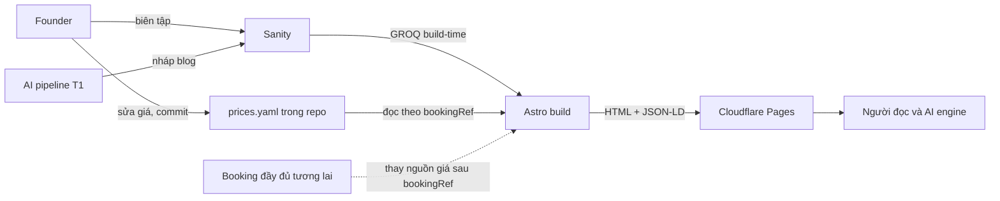
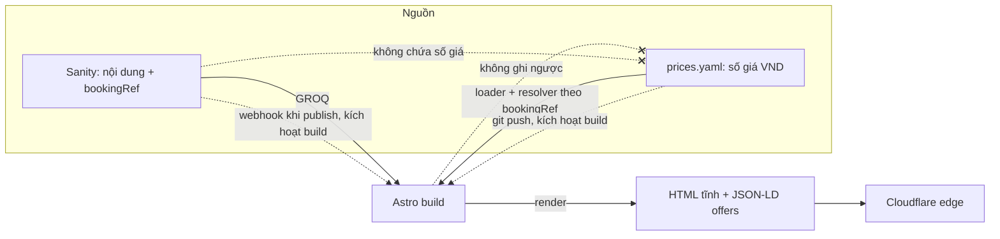

# 02 — SAD, System Architecture Document (bước 2: kiến trúc hệ thống)

<!-- ═══════════════════════════════════════════════════════════════════
CORE SPEC · Nguồn: nhatrangtravel/project/02-SAD.md · Nhóm A (tái dùng CAO)
Kiến trúc seam giá một chiều (Sanity nội dung + prices.yaml giá) gần như thuần khuôn.
Phần riêng site cần thay khi copy đi (tìm nhãn 🔧 SITE-SPECIFIC bên dưới):
  - Tiền tệ VND → tiền tệ của site.
  - Tên ví dụ dữ liệu (diving-hon-mun, muong-thanh, festival-bien-2026...) → ví dụ site.
  - Tham chiếu ADR đánh số (ADR-0001/0003/0004) → ADR của site.
Phần KHÔNG nhãn (ranh giới hai nguồn, enum unit, map JSON-LD, trigger build) = khuôn, giữ nguyên.
═══════════════════════════════════════════════════════════════════ -->

> Viết theo C4, đi từ to xuống nhỏ. Đây là design doc làm cơ sở review trước khi chốt bằng ADR (DECISION_PROCESS). Cowork soạn, chủ dự án phê chuẩn.
>
> 🔧 **SITE-SPECIFIC:** toàn bộ giá dùng **VND** và tên ví dụ dữ liệu là của nhatrangtravel. Khi dựng site khác, thay tiền tệ và ví dụ; giữ nguyên cơ chế seam.

- **Trạng thái:** đã duyệt, founder phê chuẩn 2026-06-11. Dựng cộng soát kiến trúc độc lập trong phiên (đóng 4 điểm: trigger build, JSON-LD offer, validator fail-closed, cảnh báo thiếu giá thương mại). Chốt cứng nguồn giá bằng ADR ở bước 3.
- **Phạm vi phiên này:** chốt dạng nguồn giá tối giản và cơ chế đọc một chiều lúc build (món treo bước 2 từ ADR-0003). Kiến trúc nền Sanity + Astro + Cloudflare đã chốt ở ADR-0001, ở đây mô tả vừa đủ ngữ cảnh, không mở lại.
- **Liên quan:** ADR-0001 (stack), ADR-0003 (seam giá một chiều), ADR-0004 (i18n hybrid), `01-CONTENT_MODEL.md` (I1, I14, I16, bookingRef). Kế thừa CONSTITUTION v2.2.0, PROJECT_OVERLAY v1.0.2 (S2.2 bất biến dữ liệu, S2.8 ràng buộc 8).

## 1. Bối cảnh (C1 — Context)

Hệ thống là một site tĩnh đọc nhiều, ghi ít, vận hành bởi một founder. Có hai nguồn sự thật tách theo loại dữ liệu (P6): nội dung sống ở Sanity, giá sống ở một nguồn giá riêng ngoài Sanity. Build hợp nhất hai nguồn thành HTML tĩnh cộng JSON-LD rồi đẩy ra edge.

| Tác nhân / hệ ngoài | Vai | Hướng |
|---|---|---|
| Người đọc (khách du lịch, chính quyền và đối tác, AI engine và search engine) | tiêu thụ trang tĩnh và JSON-LD | đọc |
| Founder (solo) | biên tập nội dung ở Sanity; sửa giá ở file `prices.yaml`; duyệt nội dung AI (T1) | ghi |
| Khách đặt tour (thêm 2026-08-21, ADR-0027) | gửi yêu cầu đặt qua form trên trang chi tiết Tour | ghi (vào D1, không vào hai nguồn trên) |
| Sanity Content Lake | nguồn sự thật nội dung; giữ `bookingRef`, không giữ số giá (I1) | nguồn |
| Nguồn giá `prices.yaml` | nguồn sự thật giá phase 1; giá bán công khai VND | nguồn |
| Booking đầy đủ (tương lai) | sẽ thay nguồn giá tối giản sau `bookingRef`; cửa một chiều | nguồn (sau) |
| Booking intake (thêm 2026-08-21, ADR-0027) | nhận yêu cầu đặt tour lúc runtime, lưu D1, báo email và Zalo; **không** phải nguồn giá, không thay `prices.yaml` | nhận ghi |
| Cloudflare Pages và Workers | host edge; chạy build khi git push (giá và code) hoặc webhook Sanity khi publish nội dung | hạ tầng |
| AI pipeline (Claude và/hoặc DeepSeek, T1 người duyệt) | sinh nháp nội dung blog, ngoài luồng giá | phụ trợ |



## 2. Container (C2)

| Container | Công nghệ | Trách nhiệm | Dữ liệu sở hữu |
|---|---|---|---|
| Sanity Content Lake | Sanity (hosted) | nguồn sự thật nội dung, i18n hybrid (ADR-0004) | mọi field entity trừ con số giá; `bookingRef` dạng chuỗi |
| Nguồn giá | file `prices.yaml` trong repo site | nguồn sự thật giá phase 1 | con số giá, đơn vị, `asOf`, `tiers`, `tickets`, tất cả VND |
| Web build | Astro 5+ (SSG) | đọc Sanity và `prices.yaml` lúc build, hợp nhất, render tĩnh cộng JSON-LD | không sở hữu dữ liệu, chỉ hợp nhất và xuất |
| Edge host | Cloudflare Pages và Workers | phục vụ output tĩnh, CDN; trigger build khi git push | artifact build |
| Validator (fail-closed) | bước tiền điều kiện ngay trong build, không phải check song song | kiểm `prices.yaml` và đối chiếu dataset Sanity; lỗi thì build fail nên Cloudflare không có gì để deploy (nháp 04-CONSTRAINTS) | không sở hữu, chỉ gác cổng |
| Booking intake (thêm 2026-08-21, ADR-0027) | route on-demand `/api/dat-tour` của Astro chạy trên cùng Worker; Cloudflare D1 `tourdao-booking` | nhận yêu cầu đặt tour lúc runtime: kiểm, lưu, báo tin (Resend, Zalo Bot); không đọc giá, không đọc Sanity lúc runtime | bảng `booking`: mã đơn, ngày, số người, giá tham khảo lúc đặt, PII khách; không sở hữu nội dung hay giá |
| AI content pipeline | Claude và/hoặc DeepSeek, ngân sách 500k, T1 | sinh nháp blog, người duyệt rồi nhập Sanity | không, sản phẩm vào Sanity qua người |

Ranh giới cứng giữa hai container nguồn: Sanity và nguồn giá không bao giờ ghi chéo nhau. Giá không phải entity, không có trong content model như field số (I1). `bookingRef` là cây cầu duy nhất, và nó chỉ trỏ một chiều từ Sanity sang nguồn giá.

## 3. Thành phần chính (C3) — seam giá

Phần này phóng to khối được phiên này quyết: cách nguồn giá và build nối nhau.

### 3.1 Lược đồ `prices.yaml`

Một file YAML, khóa cấp cao nhất là `bookingRef` (chuỗi, trùng giá trị `bookingRef` trong Sanity). Mỗi mục có `unit` thuộc enum đóng ba giá trị, rồi con số theo dạng tương ứng.

```yaml
# prices.yaml — giá bán công khai, VND. Cấm giá vốn, hoa hồng, dữ liệu khách (S2.8 ràng buộc 8).
diving-hon-mun:            # khóa = bookingRef bên Sanity
  unit: perPax
  amount: 850000

tour-ba-ho-rieng:
  unit: perPax
  tiers:                   # tour riêng: giá mỗi khách đổi theo cỡ nhóm
    - maxPax: 2
      amount: 1200000
    - maxPax: 6
      amount: 900000

muong-thanh:
  unit: perRoomNight
  from: 650000             # render "từ 650.000đ"
  asOf: 2026-06-10         # ngày cập nhật, bắt buộc cho lưu trú (I16)

festival-bien-2026:
  unit: perTicket
  tickets:                 # vé mình bán, nhiều hạng; một giá chỉ là một hạng
    - name: Thường
      amount: 300000
    - name: VIP
      amount: 800000
```

Quy ước theo `unit`:

| unit | Dùng cho | Hình dạng con số | Bắt buộc kèm |
|---|---|---|---|
| perPax | Experience, Tour (ghép và riêng), Attraction vé vào cửa | `amount` đơn, hoặc `tiers[]` {maxPax, amount} cho tour riêng | một trong `amount` hoặc `tiers` |
| perRoomNight | Hotel, Resort | `from` (giá khởi điểm) | `asOf` (ngày cập nhật) |
| perTicket | Event vé mình bán | `tickets[]` {name, amount} | `tickets` ≥ 1 hạng |

Bổ sung 2026-08-21 (ADR-0027): dòng `perPax` có `amount` được kèm `paxRates` tuỳ chọn — khoá con enum đóng `child | senior | infant`, mỗi khoá `{amount ≥ 0, note ≤ 40 ký tự}`; cấm kèm `tiers`. `amount` vẫn là giá người lớn và là con số duy nhất vào nhãn và JSON-LD; `paxRates` chỉ nuôi form đặt tour (`SPEC-2026-08-21-dat-tour` §4.2).

### 3.2 Thành phần trong build

| Thành phần | Trách nhiệm |
|---|---|
| Price loader | đọc và parse `prices.yaml` một lần lúc build, dựng map keyed theo `bookingRef` |
| Resolver | với mỗi entity Sanity có `bookingRef`, tra map, ghép ra view model {hiển thị, JSON-LD offer} |
| Price validator (CI) | kiểm enum `unit`; luật I14 (mọi Tour perPax); `asOf` bắt buộc cho perRoomNight; `tickets` cho perTicket; toàn vẹn tham chiếu hai phía |
| Renderer | định dạng VND; lưu trú "từ X, cập nhật [ngày]"; tour riêng hiện bảng giá theo cỡ nhóm; event hiện hạng vé; entity không có `bookingRef` thì không render khối giá |

### 3.3 Map giá sang JSON-LD

Site GEO-first nên giá vào JSON-LD có cấu trúc, không chỉ là chữ cho người đọc. `priceCurrency` luôn VND. Map theo `unit` và hình dạng con số:

| Dữ liệu giá | JSON-LD | Trường chính |
|---|---|---|
| perPax `amount` đơn; perTicket một hạng | Offer | price, priceCurrency |
| perPax `tiers` (tour riêng theo cỡ nhóm); perTicket `tickets` nhiều hạng | AggregateOffer | lowPrice, highPrice, priceCurrency, offerCount |
| perRoomNight `from` | Offer | price = from, priceCurrency; phần hiển thị thêm "từ" và `asOf` |

Entity không có giá thì không phát Offer. Không bịa `priceValidUntil` khi chưa có dữ liệu hiệu lực, cân nhắc khi viết 04-CONSTRAINTS.

## 4. Dòng dữ liệu

| Loại dữ liệu | Nguồn sự thật (P6) | Đường đi | Chiều |
|---|---|---|---|
| Nội dung | Sanity | Sanity → GROQ build-time → site | một chiều |
| Giá | nguồn giá `prices.yaml` (sau là booking) | `prices.yaml` → build đọc theo `bookingRef` → HTML và JSON-LD offers | một chiều |
| Sửa giá | founder | sửa `prices.yaml` → git commit → push → Cloudflare build lại → giá mới lên | một chiều, build-time |
| Publish nội dung | founder | publish trong Sanity → webhook gọi deploy hook Cloudflare → build lại → nội dung lên | một chiều, build-time |
| Đơn đặt tour (thêm 2026-08-21, ADR-0027) | D1 bảng `booking` | form trang tour (giá nướng lúc build) → POST `/api/dat-tour` → D1 → báo email + Zalo | một chiều vào D1; không chạm Sanity, không chạm `prices.yaml` |

Ba bất biến của dòng giá, đánh dấu rõ vì là cửa một chiều: site không bao giờ ghi ngược nguồn giá; Sanity không bao giờ chứa con số giá; build không bao giờ ghi vào `prices.yaml`. Đơn vị tính giá sống bên nguồn giá, không tách sang Sanity (I16).



Seam tương lai: khi có booking đầy đủ (đặt phòng, tồn kho), nguồn phía sau `bookingRef` đổi từ `prices.yaml` sang booking DB. Vì `bookingRef` là khóa mờ, đổi này không đụng nội dung Sanity hay entity, chỉ đổi loader và resolver. Đó là cửa một chiều, cần ADR cập nhật (ADR-0003 đã ghi hệ quả này).

## 5. Ràng buộc kiến trúc (nháp cho 04-CONSTRAINTS)

- Render tĩnh, build-time. Trang giá không gọi API giá lúc runtime; giữ một chiều và edge thuần tĩnh.
- `prices.yaml` chỉ chứa giá bán công khai VND. Cấm giá vốn, hoa hồng, thông tin khách hay khóa bí mật (S2.8 ràng buộc 8).
- Đơn vị giá là enum đóng: perPax, perRoomNight, perTicket. Thỏa "spec nguồn giá có cột đơn vị" của I16.
- **I14 phát biểu lại:** mọi Tour dùng perPax bất kể `tourFormat`; tour riêng có thể dùng `tiers` theo `maxPax`. Bỏ nhánh "private giá theo nhóm" của content model v1.0.0. Đây là đổi gate, cửa gần một chiều, ghi ở `DECISIONS.md` 2026-06-11 bước 2 SAD và cập nhật content model lên v1.0.1.
- Lưu trú (perRoomNight): bắt buộc `asOf`; render "từ X, cập nhật [ngày]" (I16, ADR-0003).
- Event vé mình bán (perTicket): bắt buộc `tickets` ≥ 1 hạng; khớp nhánh `bookingRef` của kênh vé ba nhánh (I5, 2.10).
- Toàn vẹn tham chiếu: mọi `bookingRef` trong dataset Sanity phải có dòng trong `prices.yaml`. Trỏ hụt làm CI fail và chặn deploy (founder chốt 2026-06-11). Entity không có `bookingRef` vẫn publish bình thường, không tính là lỗi (`bookingRef` không nằm trong gate publish). Dòng giá mồ côi, không entity nào trỏ tới, chỉ cảnh báo.
- Entity thương mại (Tour, Hotel, Resort, Experience, Attraction bán vé, Event bán vé) thiếu cả `bookingRef` lẫn dấu miễn phí (`isAccessibleForFree`, và `ticketUrl` với Event): CI cảnh báo để rà quên gắn giá, không chặn (founder chốt 2026-06-11). Khác trỏ hụt (chặn deploy) và khác entity phi thương mại (im lặng).
- Validator chạy như bước tiền điều kiện ngay trong build (fail-closed): lỗi thì build fail và Cloudflare không có gì để deploy, không phải check song song. Cùng họ validator I1, I14, I16, là nháp cho 04-CONSTRAINTS.
- Giá vào JSON-LD có cấu trúc theo 3.3 (Offer hoặc AggregateOffer, `priceCurrency` VND); không phát Offer khi entity không có giá.
- Hai trigger build, cả hai một chiều và dựng tĩnh: git push (giá, code) và webhook Sanity khi publish nội dung. Trang không gọi API giá lúc runtime.
- Cấm con số giá trong Sanity vẫn nguyên hiệu lực (I1, N5, hạng tuyệt đối 5.8).
- Thêm 2026-08-21 (ADR-0027): container *Booking intake* là đường ghi duy nhất lúc runtime và chỉ ghi D1; endpoint và form không đọc giá lúc runtime (tạm tính từ số nướng lúc build); token Sanity của build vẫn chỉ đọc. Thi hành ở `04-CONSTRAINTS` §1d (BK1–BK5).

## 6. Quyết định mở (cho bước 3 ADR)

| Quyết định mở | Hướng đề xuất | Cửa |
|---|---|---|
| Ghi cụ thể nguồn giá phase 1 là `prices.yaml` YAML trong repo | amend ADR-0003 hoặc ADR mới, vì ADR-0003 để mở "file, sheet hay DB" | một chiều khi sau này thay bằng booking DB |
| Ngưỡng giá cũ (stale) cho lưu trú | CI cảnh báo khi `asOf` quá ngưỡng; đề xuất 90 ngày, chốt khi viết 04-CONSTRAINTS | hai chiều, chỉnh ngưỡng tự do |
| Đường dẫn file và loader cụ thể (`data/prices.yaml`, Astro loader) | chi tiết lúc dựng site, không phải quyết định kiến trúc | hai chiều |

Đã xử trong phiên, không còn mở: dạng nguồn giá (YAML trong repo), khóa nối (`bookingRef` chuỗi), enum đơn vị, hành vi trỏ hụt (chặn deploy), tinh chỉnh I14 (đã ghi DECISIONS, content model lên v1.0.1); cộng từ soát kiến trúc: trigger build (webhook Sanity khi publish, git push cho giá và code), map giá sang JSON-LD (3.3), validator fail-closed trong build, cảnh báo thiếu giá ở entity thương mại.
